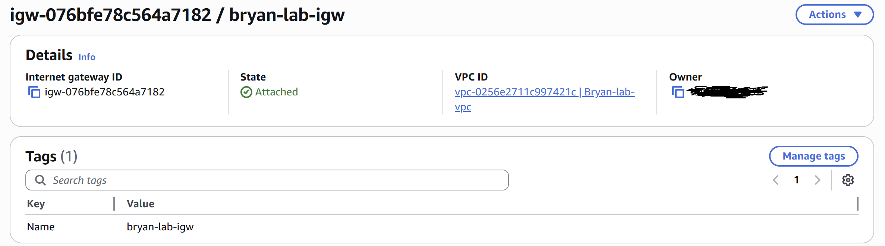

# Building a Mini Segmented Network in AWS: VPC, Subnets, and Routing from Scratch

**Date:** April 25, 2026
**Topics covered:** VPC design, CIDR notation, subnetting, route tables, Internet Gateways, network segmentation, default-deny network design

## What this writeup is

This is a hands-on walkthrough of building a custom Virtual Private Cloud (VPC) with separate public and private subnets in AWS.
Instead of using AWS's default VPC, I built every piece manually so I could understand what each component actually does.
The goal was to see — concretely — why each piece matters from both a networking and security perspective.

## Why I built this

My current cert stack is AWS Solutions Architect Associate, CompTIA Security+, and CompTIA Network+ (in progress).
Most tutorials treat these as separate fields, but they're not.
Every step of building cloud infrastructure touches all three.
This project was my way of forcing the overlap to be visible: every decision I made connected back to a Network+ or Security+ concept I'd studied.
I felt this was the best way to learn — actual hands-on experience instead of just reading a textbook.

## The architecture

By the end, here's what I built:
~~~
┌──────────────────── Bryan-lab-vpc (10.0.0.0/16) ────────────────────┐
│                                                                      │
│  ┌──── Public Subnet (10.0.1.0/24) ────┐                             │
│  │  Route table: bryan-lab-public-rt   │                             │
│  │  Routes:                            │                             │
│  │    10.0.0.0/16 → local              │                             │
│  │    0.0.0.0/0   → IGW                │ ← can reach internet        │
│  └─────────────────────────────────────┘                             │
│                                                                      │
│  ┌──── Private Subnet (10.0.2.0/24) ───┐                             │
│  │  Route table: main (default)        │                             │
│  │  Routes:                            │                             │
│  │    10.0.0.0/16 → local              │ ← isolated from internet    │
│  └─────────────────────────────────────┘                             │
│                                                                      │
│  [bryan-lab-igw] ────────────► Internet                              │
└──────────────────────────────────────────────────────────────────────┘
~~~

A VPC with two subnets in the same Availability Zone (us-east-1a).
One subnet is configured with a route to an Internet Gateway, making it "public."
The other has no internet route, making it "private."
The naming is convention — what makes a subnet truly public or private is the routing configuration, not the label.

## Pre-build cost audit

Before building anything, I audited the account for existing resources.
This is a real-world cloud habit: forgotten resources are the #1 source of surprise AWS bills.
Industry estimates put wasted cloud spend at roughly 25–35% across most companies, with "zombie resources" — orphaned volumes, forgotten instances, idle load balancers — being the biggest contributor.

What I checked:
- **EC2 instances:** None
- **Elastic IPs:** None
- **RDS databases:** None
- **S3 buckets:** None
- **Existing VPCs:** Only AWS's default VPC (free, auto-created with every account)

Confirmed clean slate before proceeding.

## Step-by-step build

### 1. Create the VPC

Created a custom VPC with the CIDR block `10.0.0.0/16`.

**Network+ angle:** `10.0.0.0/16` is a private IP range from RFC 1918.
It covers IP addresses from `10.0.0.0` to `10.0.255.255` — that's 65,536 total IP addresses (2^16).
The "/16" means the first 16 bits of the address are locked as the network portion, leaving 16 bits for hosts.

**Why use a private range?**
Public IPs are routable on the internet — anyone could potentially reach them.
Private IPs are only reachable within the VPC (or via gateways we explicitly configure).
This is the foundation of network segmentation: an attacker on the public internet cannot route packets directly to a private IP — those addresses simply aren't reachable from outside the VPC.
That's a property of IP routing itself, not your firewall configuration.
(Once something inside the VPC is compromised, of course, internal firewall rules become what protects everything else — but that's a separate problem.)

### 2. Create the subnets

Carved the VPC's `/16` range into two `/24` subnets:

| Subnet | CIDR | Total IPs | Purpose |
|---|---|---|---|
| bryan-lab-public-subnet | 10.0.1.0/24 | 256 (251 usable in AWS) | Hosts that need internet access |
| bryan-lab-private-subnet | 10.0.2.0/24 | 256 (251 usable in AWS) | Hosts that should be isolated |

**AWS reserves 5 IPs per subnet** for its own use (network address, VPC router, DNS, broadcast, future use).
So a `/24` gives 256 addresses on paper but 251 usable in practice.
Worth knowing for capacity planning.

**Sec+ angle:** Putting both subnets in the same Availability Zone (us-east-1a) is a deliberate simplification for this lab.
In a production environment, I would spread subnets across multiple AZs for fault tolerance.
That's the **Availability** pillar of the CIA triad — you trade some complexity for resilience against a data center failure.
For a learning lab, simplicity wins. For a real workload, availability would.

### 3. Create and attach the Internet Gateway

An Internet Gateway (IGW) is a virtual router that connects a VPC to the public internet.
Without it, no instance in the VPC — public or private — can reach anything outside.

**Network+ angle:** The IGW is functionally similar to the WAN port on a home router.
It's the boundary between an internal network and the wider internet.
Like a home router, it's stateless about *content* — it doesn't filter what passes through.
Filtering is a separate concern, handled by security groups and NACLs.

I created the IGW (`bryan-lab-igw`), then attached it to Bryan-lab-vpc.
After attachment, the IGW exists and is ready to route traffic — but no subnet uses it yet, because route tables don't know about it.

### 4. Create a public route table with an internet route

Route tables are where the real "public vs. private" distinction lives.
By default, AWS creates a "main route table" for every VPC with a single rule: `10.0.0.0/16 → local`.
That rule means traffic destined for anything inside the VPC goes through the VPC's internal router.
This is enough for subnets to talk to each other, but provides no path to the internet.

To make a subnet truly public, I created a new route table just for that subnet, and added a default route pointing at the IGW.

Created `bryan-lab-public-rt` and added the route:

| Destination | Target |
|---|---|
| 10.0.0.0/16 | local (auto-created) |
| 0.0.0.0/0 | igw-076bfe78c564a7182 |

**Network+ angle:** `0.0.0.0/0` is the **default route** — it matches every possible IP address.
Routing tables evaluate routes "most specific first."
Traffic destined for `10.0.x.x` matches the `10.0.0.0/16` rule (which is more specific) and stays internal.
Anything else matches `0.0.0.0/0` and goes out to the internet via the IGW.
This is identical to how routing works on physical routers.

### 5. Associate the public subnet with the public route table

The route table now has the right routes, but no subnet is using it yet.
The final step is the **subnet association** — explicitly opting `bryan-lab-public-subnet` in.

**Sec+ angle:** Notice that we explicitly opt the public subnet *in*.
We don't grant internet access by default.
This is **default-deny / explicit-allow** — the network-layer version of least privilege.
Security decisions are explicit and visible in configuration, not silent assumptions.
The private subnet stays associated with the main route table (which has no internet route), so it remains genuinely private.
Public vs. private is determined by routing — not by names or magical AWS attributes.

## What's still missing

This writeup covered the **network skeleton** only.
To actually use this network, the next steps are:

- Launch an EC2 instance in each subnet (a "bastion host" in the public subnet, an "app server" in the private one)
- Configure security groups (stateful firewall rules) for both
- SSH from my laptop → bastion → app server, demonstrating the bastion-host pattern in practice
- Confirm that the private instance is genuinely unreachable from the internet

That's the next writeup.

## Takeaways

- **Private IP ranges (RFC 1918) are the foundation of network segmentation.** They make many of AWS's security guarantees possible at the IP layer, before any firewall rule is evaluated.
- **"Public" and "private" subnets are routing decisions, not subnet attributes.** A subnet is public because its route table sends `0.0.0.0/0` traffic to an Internet Gateway. Remove that route and the subnet becomes private. This is critical to internalize — it shifts how you think about AWS networking.
- **Explicit-opt-in beats default-allow.** The public route table only applies to subnets that are explicitly associated with it. This least-privilege pattern shows up everywhere in good cloud design — from IAM permissions to network access to billing visibility.
- **Production trade-offs are visible even in a lab.** Single-AZ for simplicity vs. multi-AZ for high availability. AdministratorAccess for personal accounts vs. scoped permissions in production. Documenting these trade-offs is just as important as the implementation itself.

Although in my mind I understood how things were supposed to work, it felt great to actually create the internet gateway and attach it to the public subnet.  Nothing like seeing it live!

## Why this matters for security engineering

Network segmentation is the security control that makes everything downstream cheaper.
If a public-facing instance is compromised, segmentation is what limits the blast radius — the attacker can't pivot to private resources without first defeating additional controls.
Cloud Security Engineers spend a lot of time auditing exactly this:

- Are public subnets actually only the ones that need to be public?
- Do private subnets have any unintended path to the internet — a misrouted IGW, a misconfigured NAT, a leaked SSH key?
- Does the routing configuration match the architecture diagram, or has drift introduced silent paths?

Building this from scratch — instead of inheriting AWS's default VPC — forces every routing decision to be visible and intentional.
That's the same posture a Security Engineer brings to reviewing someone else's account: nothing is allowed by default; every connection has to justify itself.

## What's next

Next session: launching EC2 instances and demonstrating SSH-via-bastion as the actual proof that this segmentation works.
