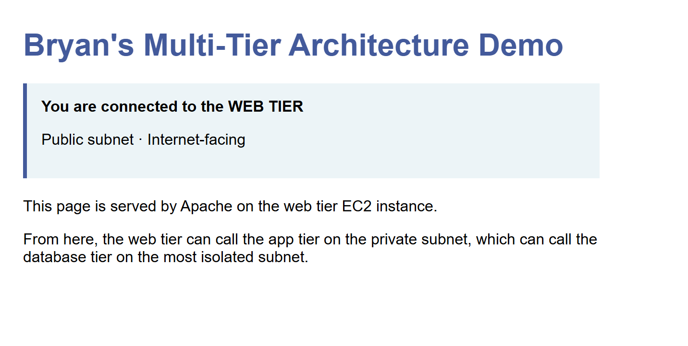
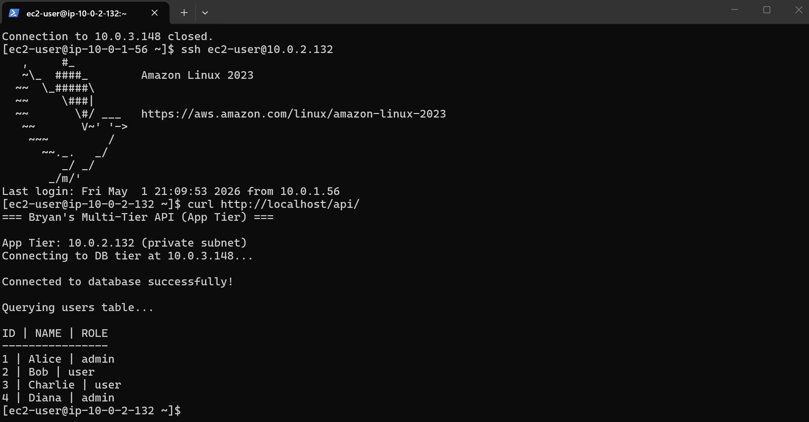
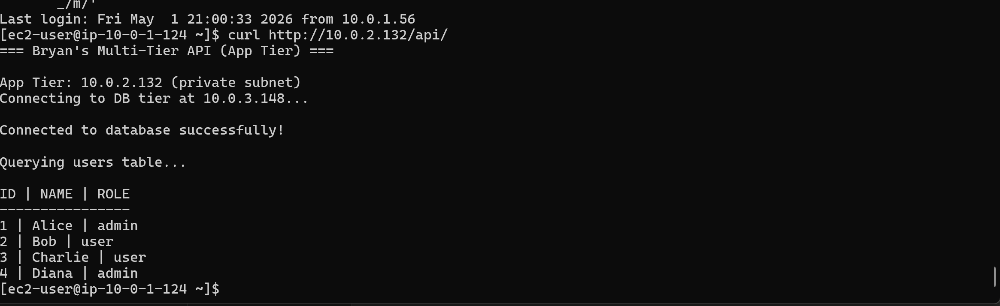
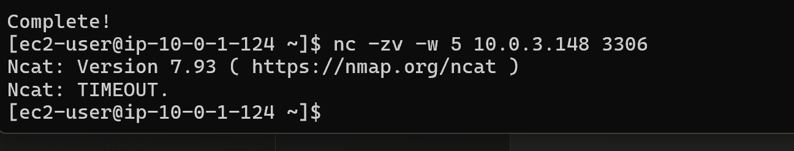
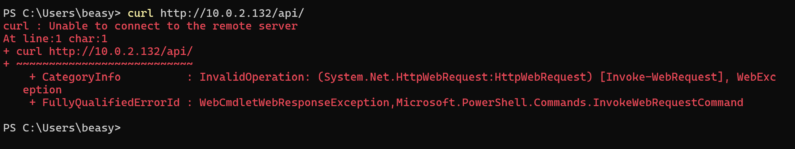
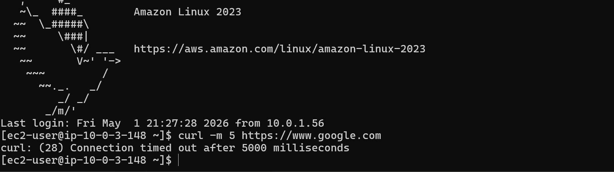

# Building a Three-Tier Architecture in AWS: Web, App, and Database Tiers with Strict Traffic Isolation

**Date:** May 1, 2026
**Topics covered:** Multi-tier architecture, security group chaining, subnet segmentation, defense in depth, Apache, PHP, MySQL, network isolation, attack surface reduction

## What this writeup is

This is the capstone of my VPC and networking arc.

Up to now, I'd built individual pieces.
A secure AWS account ([writeup #1](2026-04-24-securing-fresh-aws-account.md)).
A custom VPC with public and private subnets ([writeup #2](2026-04-25-mini-segmented-network.md)).
A bastion host pattern for secure SSH ([writeup #3](2026-04-28-ec2-bastion-host.md)).
NAT Gateway for outbound-only internet access ([writeup #4](2026-04-29-nat-gateway.md)).

This writeup pulls all of it together into one production-shaped system.
Three tiers, three subnets, three security groups, real software running on each tier, and provable traffic isolation between them.

The whole thing runs on AWS free tier.
And every "wrong" path between tiers is verifiably blocked.

## Why I built this

A multi-tier architecture is the canonical pattern for any web application that handles real data.
You see it on every Solutions Architect exam, every system design interview question, and inside the production environment of basically every company that runs on AWS.

But until you build one and prove the traffic actually flows the way you intended, it's just a diagram.
This lab was about closing that gap — going from "I can describe a three-tier architecture" to "I built one and verified its security boundaries with hands-on tests."

I'd seen three-tier diagrams in study material plenty of times, but I'd never actually built one.
The previous writeups felt like puzzle pieces I'd been collecting, and this lab was about putting them together into something that actually works.

## The architecture

```
                            Internet
                               |
              +----------------+----------------+
              |                                 |
              v                                 v
       +-------------+                  +-------------+
       |   Bastion   |                  |  Web Tier   |
       |  (Public)   |                  |  (Public)   |
       | 10.0.1.56   |                  | 10.0.1.124  |
       | EIP         |                  | Public IP   |
       | bastion-sg  |                  | web-sg      |
       +-------------+                  +-------------+
                                                |
                                         HTTP (port 80)
                                         web-sg → app-sg
                                                v
                  +----------------------------------+
                  |          App Tier                |
                  |          (Private)               |
                  |          10.0.2.132              |
                  |          NO public IP            |
                  |          app-server-sg           |
                  |          Outbound via NAT        |
                  +----------------------------------+
                                                |
                                         MySQL (port 3306)
                                         app-sg → db-sg
                                                v
                  +----------------------------------+
                  |         Database Tier            |
                  |         (Most isolated)          |
                  |         10.0.3.148               |
                  |         NO public IP             |
                  |         db-sg                    |
                  |         ZERO internet access     |
                  +----------------------------------+
```

Three subnets, each with its own purpose:

- **Public subnet (10.0.1.0/24)** — bastion + web tier. Reachable from the internet.
- **Private subnet (10.0.2.0/24)** — app tier. No public IP, only reachable from inside the VPC.
- **Database subnet (10.0.3.0/24)** — DB tier. No public IP, no outbound internet route, fully isolated.

Three security groups, each enforcing one tier's access policy:

- **web-sg** — allows HTTP (port 80) from the entire internet, SSH only from bastion
- **app-server-sg** — allows HTTP only from web-sg (not the internet directly), SSH only from bastion
- **db-sg** — allows MySQL (port 3306) only from app-server-sg, SSH only from bastion

## The "tier" insight that took me a while to grasp

A "tier" is not a property of the EC2 instance.
A `t2.micro` running on AWS doesn't know whether it's a "web tier" or a "database tier."
It's just a Linux box.

What makes one server a web tier and another a database tier is the combination of:

1. **Which subnet it's in** — controls broad network reachability via route tables and IP ranges
2. **Which security groups apply to it** — controls fine-grained access at the instance level (who can talk to me, on which port)
3. **What software is running on it** — defines the role

Number 3 is the role.
Numbers 1 and 2 are how the role is *enforced*.

Without strict subnet and security group separation, an attacker who compromises one tier can pivot to the others.
With it, even a fully compromised web tier can't reach the database directly.
That's the whole point of the architecture.

## Step 1 — Add the database subnet

I already had public and private subnets from earlier writeups.
For this lab, I added a third subnet specifically for the database tier:

- **Name:** `bryan-lab-db-subnet`
- **CIDR:** `10.0.3.0/24` (256 IPs, continues my third-octet pattern: 1=public, 2=private, 3=db)
- **AZ:** `us-east-1a` (matches existing subnets)
- **Route table:** A new dedicated `bryan-lab-db-rt` with ONLY the local VPC route — no internet, no NAT

That last point is critical.
The database tier should never reach the internet under normal operation.
A dedicated route table with no `0.0.0.0/0` rule means there's literally no path from the DB tier to anywhere outside the VPC.

## Step 2 — Three tier-specific security groups

This is where the multi-tier traffic flow actually gets enforced.

Each security group references the previous tier's security group as its allowed source — not an IP, not a CIDR, but the security group itself.
This is called **security group chaining**, and it's how AWS lets you build flexible, identity-based firewalls instead of brittle IP-based ones.

**web-sg (web tier):**

- Inbound: HTTP (port 80) from `0.0.0.0/0` (anywhere on the internet)
- Inbound: SSH (port 22) from `bastion-sg`

**app-server-sg (app tier):**

- Inbound: HTTP (port 80) from `web-sg`
- Inbound: SSH (port 22) from `bastion-sg`

**db-sg (database tier):**

- Inbound: MySQL (port 3306) from `app-server-sg`
- Inbound: SSH (port 22) from `bastion-sg`

Read those rules carefully and notice what's *not* there:

- Internet can't reach the app tier directly (only `web-sg` can talk to `app-server-sg`)
- Internet can't reach the DB tier at all
- Web tier can't reach the DB tier directly (only `app-server-sg` can talk to `db-sg`)
- Nothing can MySQL into the DB except the app tier

That's defense in depth at the network layer, with each tier trusting only the specific tier above it.

## Step 3 — The web tier

A `t2.micro` in the public subnet, with a public IP, running Apache and serving a custom HTML page.
Apache install was straightforward:

```bash
sudo yum update -y
sudo yum install httpd -y
sudo systemctl start httpd
sudo systemctl enable httpd
```

I dropped a styled HTML file into `/var/www/html/index.html` describing the architecture, and visited the public IP from my laptop's browser:



The page loaded.
That's proof of the public-facing entry point: internet → IGW → web-sg (port 80 from anywhere) → Apache → response back.

## Step 4 — The app tier

A `t2.micro` in the private subnet with NO public IP, running Apache + PHP + the PHP-MySQL driver.

The install required temporary outbound internet for `yum install`, which the app tier has via the NAT Gateway from [writeup #4](2026-04-29-nat-gateway.md).

```bash
sudo yum update -y
sudo yum install httpd php php-mysqlnd -y
sudo systemctl start httpd
sudo systemctl enable httpd
```

Then I created an "API" endpoint at `/var/www/html/api/index.php` that connects to MySQL on the DB tier and returns user data.

The PHP script lives on the app tier.
It reaches across the VPC to the DB tier's private IP (`10.0.3.148`) on port 3306, runs `SELECT id, name, role FROM users`, and returns the result as plain text.

## Step 5 — The database tier

A `t2.micro` in the new database subnet with NO public IP, running MySQL 8.

This was the trickiest install of the three.
Amazon Linux 2023 ships with MariaDB by default, not MySQL.
I had to add the official MySQL community repo first, then install:

```bash
sudo dnf install -y https://dev.mysql.com/get/mysql80-community-release-el9-1.noarch.rpm
sudo rpm --import https://repo.mysql.com/RPM-GPG-KEY-mysql-2023
sudo dnf install mysql-community-server -y
sudo systemctl start mysqld
sudo systemctl enable mysqld
```

Then I:

- Changed the auto-generated root password
- Created a `demo_db` database
- Created a `users` table with `id`, `name`, `role` columns
- Inserted four sample rows (Alice/admin, Bob/user, Charlie/user, Diana/admin)
- Created an `app_user` MySQL user with permission to read/write `demo_db` from any host
- Edited `/etc/my.cnf` to set `bind-address=0.0.0.0` so MySQL listens on all interfaces, not just localhost

The bind-address change is critical.
By default, MySQL only accepts connections from `127.0.0.1` (its own loopback).
For the app tier to reach it across the VPC, MySQL needs to listen on the network interface.

The security group still locks down WHO can reach it — only `app-server-sg`.
The bind-address just lets MySQL accept the connection in the first place.

## Step 6 — Test 1: App tier successfully queries DB tier

The first proof.
SSH'd from bastion to app tier, then ran the API curl:

```bash
curl http://localhost/api/
```

Result:



Connected to database successfully.
Pulled all 4 user rows.
This proves the app↔DB security group rule works:

- App tier wears `app-server-sg`
- DB tier's `db-sg` accepts MySQL from `app-server-sg`
- The packet matches the rule, gets through, MySQL responds

## Step 7 — Test 2: Web tier successfully queries app tier (full chain)

The big test.
SSH'd from bastion to the web tier, then hit the app tier's API endpoint using its private IP:

```bash
curl http://10.0.2.132/api/
```

Result:



Same user data, but this time the request started on the web tier, hopped to the app tier on HTTP, which then hopped to the DB tier on MySQL, and the response flowed all the way back.

End-to-end, full three-tier chain, working.

## Step 8 — Test 3: Web tier BLOCKED from DB tier directly (negative test)

Now for the security verification.
The architecture is supposed to prevent the web tier from reaching the database directly — even though they're both inside the same VPC.

From the web tier:

```bash
nc -zv -w 5 10.0.3.148 3306
```

Result:



`Ncat: TIMEOUT.`

That timeout is the proof.
The packet was silently dropped because:

- Web tier wears `web-sg`
- DB tier's `db-sg` only accepts MySQL traffic from `app-server-sg`
- `web-sg` is not in any allow rule on `db-sg`
- AWS drops the packet at the network interface level

Even though both servers are in the same VPC and could theoretically reach each other at the network layer, the security groups create a virtual firewall that says "no, you don't have the right badge."

## Step 9 — Test 4: Internet BLOCKED from app tier (negative test)

From my laptop, on the public internet, I tried to hit the app tier's private IP directly:

```bash
curl http://10.0.2.132/api/
```

Result:



`Unable to connect to the remote server.`

Two reasons this fails, either of which would be enough on its own:

1. `10.0.2.132` is a private IP (10.x.x.x range) — not routable on the public internet
2. Even if you somehow reached the VPC, `app-server-sg` only allows HTTP from `web-sg`, not from any IP

The app tier is genuinely invisible from the internet.

## Step 10 — Test 5: DB tier has ZERO internet access (final isolation)

After installing MySQL, I removed the temporary NAT Gateway route from `bryan-lab-db-rt`.
The DB tier is now back to its production state — no internet access in any direction.

From the DB tier:

```bash
curl -m 5 https://www.google.com
```

Result:



Connection times out.
The DB tier has no path to the internet.
No way to phone home to a command-and-control server.
No way to exfiltrate data to an external endpoint.
No way to download additional malware if compromised.

This is **egress filtering** — controlling what can leave your network, not just what can enter.
Most security writeups focus on inbound rules ("how do attackers get in?").
The senior-level thinking is also asking "if they get in, can they get back out with the data?"

## The Network+ angle: layered network controls

Multiple OSI layers of separation work together here:

**Layer 3 (network) — Subnets and route tables:**
- Each tier in a different subnet (different IP range)
- DB subnet has a route table with no internet routes — the DB literally has no path to the internet at the routing layer

**Layer 4 (transport) — Security groups:**
- Stateful firewalls at the network interface level
- Reference other security groups instead of IPs (identity-based, not address-based)
- Specific port-level rules (80 for HTTP, 3306 for MySQL, 22 for SSH)

**Layer 7 (application) — Application-level access:**
- MySQL `app_user` has only `SELECT, INSERT, UPDATE, DELETE` on `demo_db.*` — no `DROP`, no admin rights
- Apache + PHP serving only the API endpoint, not arbitrary file access

Defense in depth means every one of these layers would have to fail for an attack to succeed.

## The Security+ angle: blast radius and the principle of least privilege

The whole point of this architecture is to **minimize blast radius** — the damage an attacker can do after a successful compromise.

Imagine an attacker fully compromises the web tier (somehow exploits Apache, gets root):

- They can serve modified HTML to your users (bad, but limited)
- They can attempt to scan the internal network — but security groups silently drop most of those packets
- They can reach the app tier on HTTP port 80 only — they'd have to compromise the API itself to do real damage
- They CANNOT reach the database directly — the DB only trusts the app tier's badge
- They CANNOT exfiltrate data through the DB tier — the DB has no internet
- They CANNOT pivot deeper than the next tier

Every wall they have to climb adds time, complexity, and noise.
Time and noise are what your monitoring tools detect.
Defenders can only respond to attacks they can detect — slow attackers are detectable attackers.

This is the principle of least privilege applied at the network level: **each component has the minimum access required to do its job and nothing more.**

## What's missing (and why it matters for honest portfolio work)

A truly hardened production version of this architecture would also include:

- **AWS Secrets Manager** for the MySQL password (right now it's hardcoded in the PHP script — a real security issue)
- **IAM roles for EC2** so the app tier authenticates to AWS services without long-lived credentials
- **TLS encryption** between web/app and app/DB (right now everything is plaintext within the VPC)
- **VPC Flow Logs** for network traffic auditing
- **RDS** instead of self-managed MySQL on EC2 for managed backups and patching
- **Application Load Balancer** in front of multiple web tier instances for high availability
- **Auto Scaling Group** for the web tier to handle traffic spikes
- **Multi-AZ deployment** for production resilience

I haven't done these yet.
They're each their own substantial topic, and they'll be the subjects of upcoming writeups.
But the foundation — the network and security group architecture — is sound, and everything else layers on top of this.

## What I learned

The most satisfying moment of this whole portfolio so far was watching the full chain work end-to-end.
What I'd been studying as abstract concepts in the certs suddenly felt tangible — there's a real difference between reading about three-tier architecture and proving the data actually flows through it.
The negative tests were the other big shift.
A week ago I would have thought "security = block the bad stuff."
Now I get that proving something is correctly BLOCKED is just as important as proving the right things work.

## What's next

This writeup completes the foundational network and architecture arc.
Next, I'm going to start hardening this same architecture with managed AWS services:

- **RDS** to replace the self-managed MySQL on the DB tier
- **Application Load Balancer** in front of multiple web tier instances
- **Auto Scaling Group** for the web tier
- **AWS Secrets Manager** to move the database credentials out of source code

Each of those is a writeup of its own — and each one builds directly on top of what's standing in this lab.

---

*This is the fifth writeup in my AWS Solutions Architect portfolio. Earlier writeups covered [securing a fresh AWS account](2026-04-24-securing-fresh-aws-account.md), [building the VPC and subnets](2026-04-25-mini-segmented-network.md), [the bastion host pattern](2026-04-28-ec2-bastion-host.md), and [adding outbound-only internet via NAT Gateway](2026-04-29-nat-gateway.md).*
