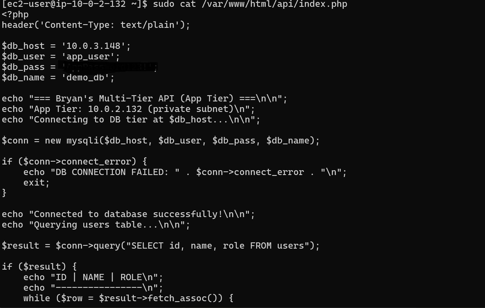
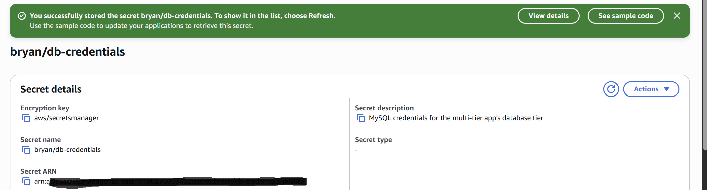
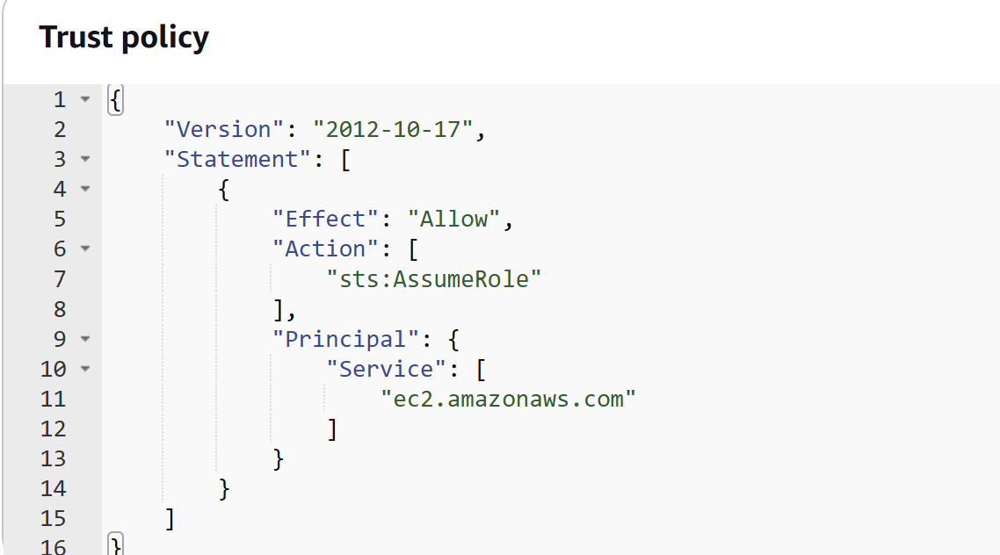
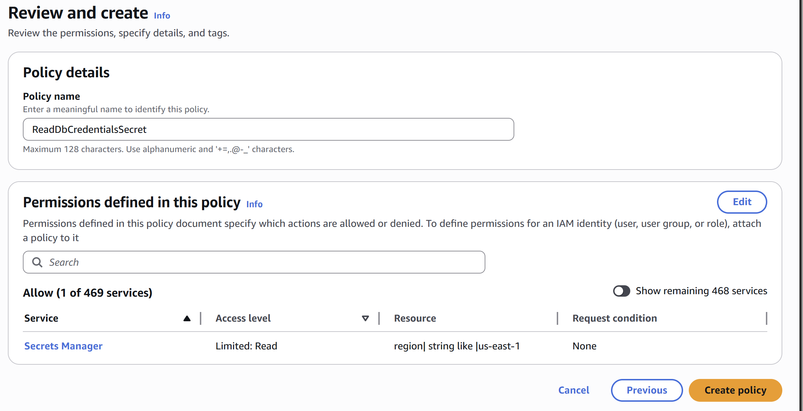
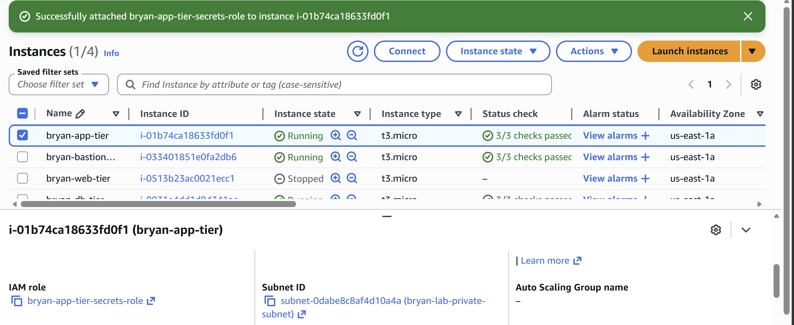
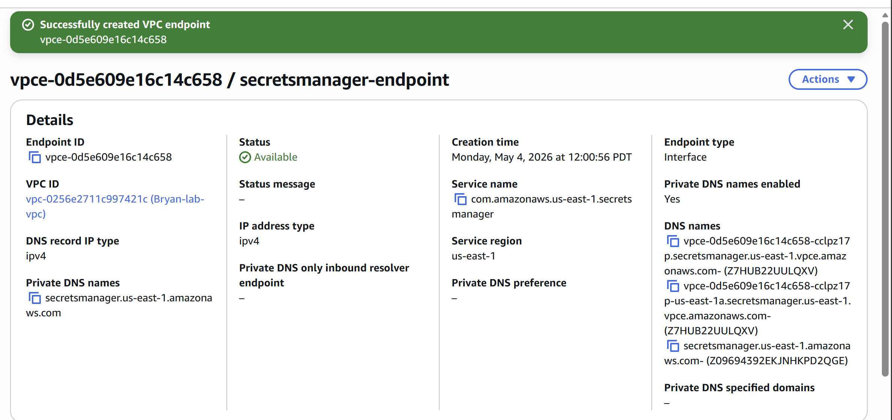
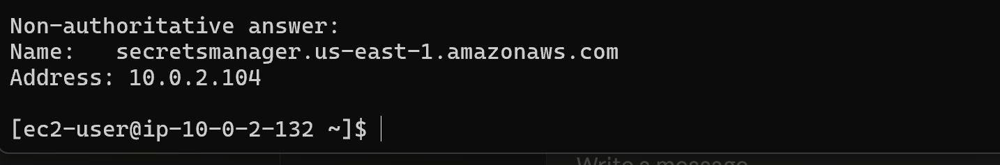
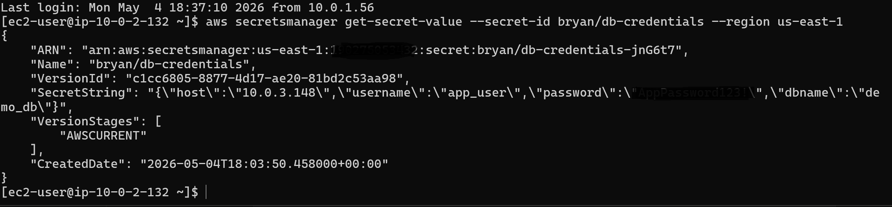
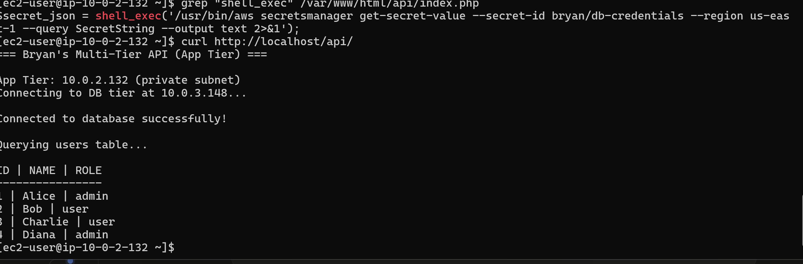

# Replacing Hardcoded Credentials with IAM Roles + Secrets Manager

This lab was about removing a hardcoded database password from a PHP file
and having the application fetch it at runtime from AWS Secrets Manager instead.
The end behavior of the app is identical;
the security posture is completely different.

## The starting state

The app tier had this in `index.php`:

```php
$db_host = '10.0.3.148';
$db_user = 'app_user';
$db_pass = 'AppPassword123!';
$db_name = 'demo_db';
```

That password sitting in plain text is the problem.
Anyone who can read the source file knows the production credential.
If this code ever lands in a Git commit, the password is leaked permanently —
even if you "fix" it later, it lives in the repo's history.
Rotating the password means a code change and a deploy,
which is friction nobody actually wants to deal with,
which means in practice the password never gets rotated.
None of that is acceptable in a real environment.



## What I built

Four moving parts working together:

- **AWS Secrets Manager** stores the credentials as a JSON blob (host, username, password, dbname).
- **An IAM role** attached to the EC2 instance proves the instance's identity to AWS without needing access keys on disk.
- **A VPC endpoint for Secrets Manager** lets the app tier (which lives in a private subnet with no internet) reach the service privately.
- **The updated PHP** fetches the secret at runtime via the AWS CLI; no credentials baked in.

## Step 1 — Create the secret

I created a secret called `bryan/db-credentials` with key/value pairs for host, username, password, and dbname.



## Step 2 — IAM role with least-privilege policy

I created an IAM role called `bryan-app-tier-secrets-role`
with an inline policy that allows only `secretsmanager:GetSecretValue`,
scoped to the specific ARN of this one secret.
No wildcards.
No other actions.

The trust policy lets EC2 assume the role:




Then I attached the role to the `bryan-app-tier` EC2 instance.



The reason to use a role and not access keys is straightforward:
access keys sitting on a server are a long-lived credential that can be stolen.
An IAM role gets short-lived credentials that the EC2 instance metadata service hands out automatically and rotates behind the scenes.
The application code never sees them, never stores them, never thinks about them.

## Step 3 — VPC endpoint for private connectivity

The app tier lives in a private subnet with no internet route.
But Secrets Manager normally lives at `secretsmanager.us-east-1.amazonaws.com` on the public internet.
A VPC endpoint solves this by creating a private "side door" inside the VPC that routes directly to the service.

After creating the endpoint with private DNS enabled,
an `nslookup` from the app tier confirmed DNS now points at a private IP (`10.0.2.104`):




## Step 4 — The security group gotcha

This was the actual learning moment of the lab.

After everything was set up, the AWS CLI call from the app tier hung indefinitely.
DNS was resolving to the private IP correctly.
The IAM role was attached.
The endpoint was showing as Available.
Nothing in the obvious places looked wrong.

The clue was that the call *hung* rather than failing immediately.
A hang usually means packets are being silently dropped — not that the destination is unreachable.
That's a security group symptom, not a routing or DNS one.

The endpoint isn't a magic gateway under the hood.
It's actually a network card (an ENI) sitting in the subnet,
and like any network card in AWS, it's protected by a security group.
When I created the endpoint, I'd attached `app-server-sg` to it.
That security group had rules for the app tier server itself —
HTTP from the web tier, SSH from the bastion —
but nothing that allowed HTTPS traffic to the endpoint.

The fix was a self-referencing inbound rule on `app-server-sg`,
allowing port 443 from the security group itself.
This works because both the app tier instance *and* the endpoint's network card live in the same security group,
so the rule effectively says "members of this group can talk to each other on 443."

After saving the rule, the CLI returned the secret in a couple of seconds:



Two things stuck with me from this section.
First, hangs and refusals look the same to a human — "the thing isn't working" —
but they mean very different things underneath,
and a hang almost always points to a firewall silently dropping packets.
Second, a security group attached to a VPC endpoint isn't a "this endpoint is part of the app tier" statement.
It's a firewall protecting the endpoint's network card.
Once that mental model clicks, the self-referencing rule pattern stops looking weird and starts looking obvious.

## Step 5 — Updating the PHP

I replaced the four hardcoded variables with a runtime fetch:

```php
// Fetch DB credentials from AWS Secrets Manager at runtime.
// Auth comes from the IAM role attached to this EC2 instance —
// no access keys stored anywhere on disk.
putenv('HOME=/tmp');  // Apache user has no HOME; AWS CLI requires one.

$secret_json = shell_exec('/usr/bin/aws secretsmanager get-secret-value --secret-id bryan/db-credentials --region us-east-1 --query SecretString --output text 2>&1');

if (!$secret_json) {
    echo "Failed to fetch credentials from Secrets Manager\n";
    exit;
}

$creds = json_decode(trim($secret_json), true);
if (!$creds) {
    echo "Failed to parse credentials JSON: $secret_json\n";
    exit;
}

$db_host = $creds['host'];
$db_user = $creds['username'];
$db_pass = $creds['password'];
$db_name = $creds['dbname'];
```

A few details worth understanding line by line.
The `putenv('HOME=/tmp')` is necessary because Apache runs as a user with no HOME directory,
and the AWS CLI needs one to operate or it complains and exits.
The `shell_exec` runs the AWS CLI;
authentication comes from the IAM role automatically via the instance metadata service,
so the application has no awareness of credentials at all.
The `--query SecretString --output text` flags pull just the inner JSON string out of the response,
saving a double parse.
I kept the variable names (`$db_host`, etc.) identical to the original
so the rest of the file is completely untouched.

After saving, `curl http://localhost/api/` returned the same user data as before:



Same output, same behavior, no credentials anywhere in the source code.
The PHP started, called the AWS CLI, the CLI authenticated using the IAM role,
sent an HTTPS request to Secrets Manager via the VPC endpoint (no public internet),
got back the JSON, parsed it, and used the values to connect to MySQL.
That entire flow is invisible to anyone reading the application code.

## What I learned

- **Hangs vs. refusals are different problems.** A hang almost always means a firewall is silently dropping packets. A refusal means the destination is reachable but actively saying no. Different symptoms, different fixes.
- **Security groups on VPC endpoints aren't "tier membership."** They're firewalls on the endpoint's network card. Once that clicks, the self-referencing rule pattern makes obvious sense.
- **IAM roles + instance metadata are invisible to application code.** The PHP doesn't know it's authenticating. It just calls `aws ...` and the CLI handles everything underneath. This is the whole reason roles exist instead of access keys.
- **Least privilege matters even in labs.** Scoping the IAM policy to the specific secret ARN, not `secretsmanager:*`, is a 5-second decision that pays off forever as a habit.

## What's next

Planning to pivot toward security-flavored writeups soon —
VPC Flow Logs to see traffic between the app tier and the endpoint,
CloudTrail to audit who's calling `GetSecretValue`,
GuardDuty for anomaly detection on top of it all.
A few more pure-AWS labs first (ALB, Auto Scaling, RDS) to round out the architecture track,
then full pivot into the security side.
