# From Single Instance to Self-Healing Fleet: Adding an ALB and Auto Scaling Group

**Date:** May 7, 2026
**Topics covered:** Application Load Balancer, Auto Scaling Group, AMIs, launch templates, target groups, multi-AZ resilience, security group chaining, health checks, self-healing infrastructure, connection draining

## What this writeup is

This writeup transitions my web tier from a single EC2 instance to a self-healing fleet behind an Application Load Balancer.
I put an ALB in front of the web tier,
locked down direct internet access so the only way in is through the ALB,
turned the existing instance into a reusable AMI,
and replaced "the web tier" with an Auto Scaling Group of identical instances
distributed across two Availability Zones, configured to self-heal when an instance fails.

To prove it actually works, I terminated an instance on purpose
and watched the system recover with no manual intervention.

## Why I built this

In [Writeup #6](2026-05-05-iam-secrets-manager.md), I fixed the most embarrassing security flaw in my web tier —
a hardcoded database password sitting in PHP source — by moving the credential
into AWS Secrets Manager and giving the EC2 instance an IAM role with permission to fetch it.

That writeup hardened a credential.
This one hardens the architecture itself.

After Writeup #6, my entire public-facing web tier was still one EC2 instance.
One Linux box, one IP address, one path between the internet and my application.
If Apache crashed, the site went down.
If the instance was patched and rebooted, the site went down.
If AWS had an Availability Zone outage, the site went down.
If the underlying hardware failed, the site went down for hours while I rebuilt from scratch.

A single instance is fine for a homelab.
It's not a real architecture.

---

## The architecture goal

**Before:**

```
Internet  →  bryan-web-tier (single EC2, public IP, port 80 open to the world)
```

**After:**

```
Internet  →  ALB (multi-AZ, public-facing)
                ↓
              Target Group (web-tier-tg)
                ↓
              ASG-managed fleet (2 instances, one per AZ)
                ↓
              [self-heals on failure, replaces from AMI]
```

The endgame has six properties I didn't have before:

1. **Multiple instances behind a single endpoint.**
   The internet sees one DNS name; behind that name is a fleet that can grow, shrink, and replace members.
2. **No direct internet access to instances.**
   Traffic enters through the ALB or it doesn't enter at all.
   The instances themselves can't be reached on port 80 from the open internet.
3. **Multi-AZ resilience.**
   Instances run in `us-east-1a` and `us-east-1b`. A zonal outage no longer takes the site down.
4. **Self-healing.**
   If an instance fails health checks, the Auto Scaling Group terminates it and launches a fresh replacement from a known-good AMI.
5. **Reproducible instance state.**
   Every instance launched from the AMI is byte-identical. No drift, no manual configuration.
6. **Graceful failover.**
   Connection draining at the ALB lets in-flight requests finish during deregistration.

The whole thing took two sessions to build.
I'll walk through it as one continuous arc.

---

## Section 1: Building the Application Load Balancer

## Step 1 — The "before" baseline

Before I changed anything, I confirmed the existing setup was working
so I'd have a clean before/after comparison.

I hit the web tier's public IP directly in a browser:

```
http://34.201.151.190/
```

The page loaded — Apache serving the multi-tier demo content from earlier writeups.
The page even literally said "Internet-facing" in its body text,
which by the end of this writeup would no longer be accurate.

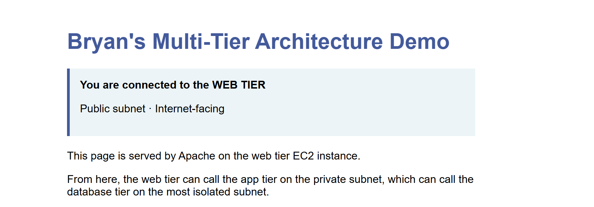

This screenshot is the "before" snapshot.
A reader can see the current state with no ambiguity:
the web tier is serving traffic directly from its own public IP,
no load balancer involved.

---

## Step 2 — Create a security group for the ALB (`alb-sg`)

The ALB needs its own security group, separate from `web-sg`.
This sounds pedantic but it's actually one of the most important security decisions in the whole writeup.

I created `alb-sg` with one inbound rule:

| Type | Protocol | Port | Source | Description |
|---|---|---|---|---|
| HTTP | TCP | 80 | `0.0.0.0/0` | HTTP from internet |

**Why a separate SG instead of reusing `web-sg`:**

The ALB and the web tier have *opposite* security postures.

- The ALB's job is "accept HTTP from the entire internet." That's a wide-open inbound rule.
- The web tier's job is "accept HTTP only from the ALB." That's a narrow, restricted rule.

If I tried to merge them into one security group I'd lose the distinction.
By giving each component its own SG, I can express "the ALB is the only door to the internet,
and the web tier is one step deeper" as actual firewall rules, not as documentation.

This pattern is called **security group chaining**:
each tier's SG references the previous tier's SG, not raw IPs.
The web tier's SG ends up saying "allow 80 from `alb-sg`," not "allow 80 from `0.0.0.0/0`."
The ALB doesn't have stable IPs — they change as AWS scales the ALB nodes —
so referencing the SG itself rather than addresses is the only design that survives over time.

It's also why a `0.0.0.0/0` rule on `alb-sg` is fine,
but a `0.0.0.0/0` rule on `web-sg` would be a security failure.
Same CIDR, completely different risk profile depending on which component you're protecting.

---

## Step 3 — Create the target group

A **target group** is a separate resource from the ALB itself.
The ALB is the front door; the target group is the list of backend instances behind that door.
They're decoupled on purpose.

I created `web-tier-tg`:

- **Target type:** Instances
- **Protocol/Port:** HTTP / 80
- **VPC:** `Bryan-lab-vpc`
- **Health check path:** `/` (root)
- **Registered target:** `bryan-web-tier`

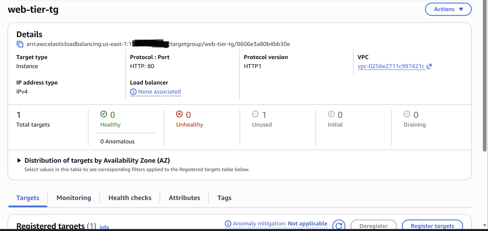

The target group page shows my single registered target with status "unused" —
that's correct at this point, because no load balancer is attached yet
and therefore no health checks are running.

**Why the ALB and target group are separate resources:**

The decoupling lets you do useful things later:

- Attach *one* target group to *multiple* ALBs (e.g., a public ALB and an internal ALB sharing the same backend fleet).
- Have *one* ALB route different URL paths to *different* target groups (`/api/*` → app target group, everything else → web target group).
- Replace the ALB without re-registering all your instances.

For this lab I have one ALB and one target group, so the separation feels like extra ceremony.
But it's the same architecture pattern used in production at scale,
and it's about to matter a lot when the Auto Scaling Group needs to register
and deregister instances dynamically without ever touching the ALB.

---

## Step 4 — Add a second public subnet (the multi-AZ requirement)

When I tried to create the ALB, AWS surfaced a hard requirement I hadn't planned for:
**ALBs must span at least two Availability Zones.**

My existing VPC only had public subnet space in `us-east-1a`,
so I had to create a sibling public subnet in `us-east-1b` before the ALB form would let me proceed.

The subnet itself was straightforward:

- **Name:** `bryan-lab-public-subnet-1b`
- **AZ:** `us-east-1b`
- **CIDR:** `10.0.4.0/24` (sequential with the existing `10.0.1.0/24` public, `10.0.2.0/24` private, `10.0.3.0/24` db)

But here's the gotcha: **creating a subnet doesn't make it public**.
AWS associates new subnets with the VPC's main route table by default,
which in my setup was the *private* route table — no Internet Gateway route.
A subnet with no path to an IGW is, by definition, private.

I had to explicitly associate the new subnet with the *public* route table —
the one that already had `0.0.0.0/0 → igw-xxx`.
Once I did that, both `bryan-lab-public-subnet` and `bryan-lab-public-subnet-1b`
were associated with the same public route table, and both could reach the internet.

**Why AWS forces multi-AZ on ALBs:**

The ALB is meant to be the *most* reliable component in the architecture.
By requiring multi-AZ, AWS guarantees that you can't accidentally build a load balancer
that's a single point of failure.
Behind the scenes, AWS deploys two ALB nodes — one in each subnet you pick —
sharing the same DNS name and configuration but operating independently.
If one AZ goes down, DNS automatically routes traffic to the survivor.

---

## Step 5 — Create the ALB

With the second subnet in place, the ALB form had everything it needed:

- **Name:** `web-tier-alb`
- **Scheme:** Internet-facing
- **VPC:** `Bryan-lab-vpc`
- **Mappings:** both `us-east-1a` (`bryan-lab-public-subnet`) and `us-east-1b` (`bryan-lab-public-subnet-1b`) selected
- **Security group:** `alb-sg`
- **Listener:** HTTP:80 → forward to `web-tier-tg`

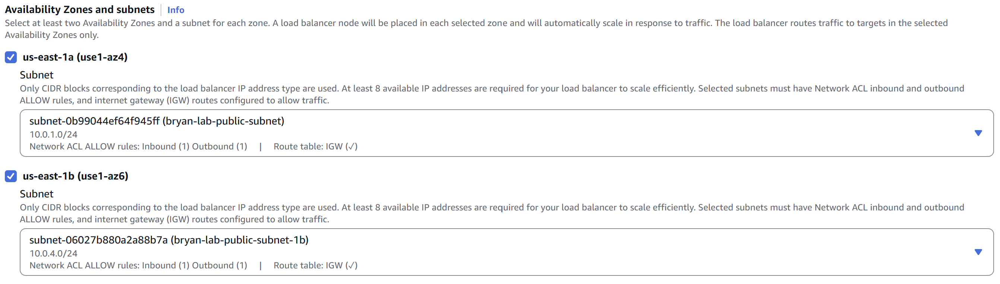

After about three minutes of provisioning,
the ALB transitioned from "Provisioning" to "Active"
and AWS gave it a DNS name:

```
web-tier-alb-225883022.us-east-1.elb.amazonaws.com
```

I hit it in a browser, and the same demo page loaded — with one critical difference.
The address bar now showed the ALB DNS name, not the EC2 instance's IP.

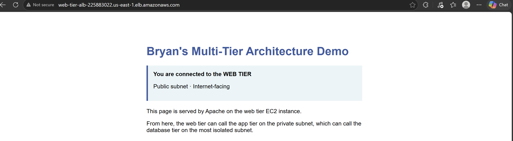

What this proves end-to-end:

1. DNS resolved the ALB's DNS name to one of the ALB node IPs (one per AZ).
2. The ALB received the HTTP request.
3. It consulted the target group and found `bryan-web-tier` registered and healthy.
4. It forwarded the request to the instance.
5. Apache served the page, response went back through the ALB to my browser.

Same content as before, completely different path.

---

## Step 6 — The security cutover

This is the moment that turns the ALB from "an extra hop" into "an actual security boundary."

Right now, the web tier is reachable both through the ALB *and* directly via its public IP.
That second path needs to die.

I edited `web-sg` and replaced its inbound HTTP rule.

**Before:**

| Type | Source | Description |
|---|---|---|
| HTTP | `0.0.0.0/0` | HTTP from anywhere |

**After:**

| Type | Source | Description |
|---|---|---|
| HTTP | `alb-sg` | HTTP from ALB only |

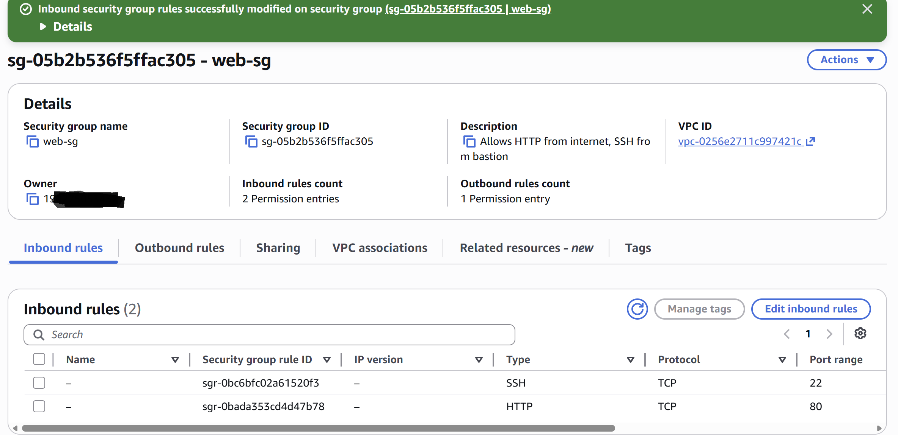

Then I ran the two-test verification.

**Test 1: ALB still works.**
I hit the ALB DNS again. The page loaded immediately.

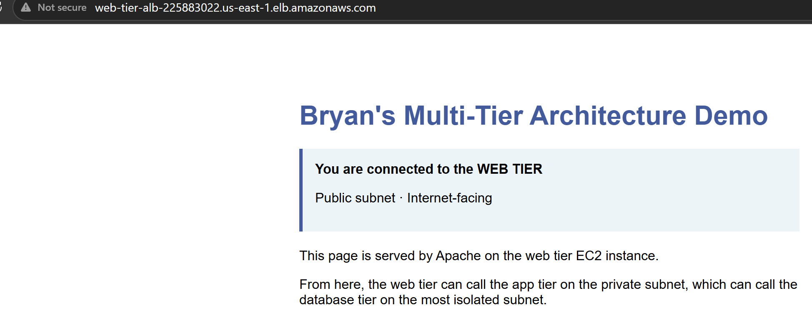

**Test 2: Direct IP no longer works.**
I hit the web tier's public IP directly. The browser hung, then timed out with `ERR_CONNECTION_TIMED_OUT`.

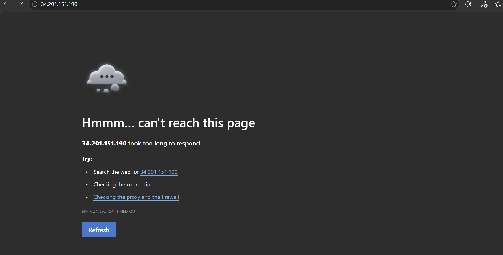

That before/after pair is the cleanest visual evidence of the security improvement.
Same backend, same content, one path now works and the other doesn't.

**Why the failure mode is "timeout" and not "connection refused":**

When a security group blocks traffic, it doesn't actively reject the packet.
It silently drops it.
That's a deliberate choice — actively rejecting (`RST` packets) would tell an attacker
"there's something here, you just can't reach it on this port."
Silent drops make the host effectively invisible:
the attacker's connection sits there waiting for a response that never arrives,
and they can't tell whether the host is down, doesn't exist, or is firewalled.

This same diagnostic pattern came up in Writeup #6 with the VPC endpoint debug —
"hang vs refused" tells you whether you're hitting a security group block
or a service that's actually rejecting you.

---

## Section 2: Building the Auto Scaling Group

The ALB has a load balancer with one backend behind it,
which means it isn't actually doing much load balancing yet.
The next phase replaces "one backend" with "an automatically managed fleet of identical backends."

## Step 7 — Build the AMI

The AMI is the photocopy master.
Without it, the ASG would launch blank Linux boxes with no idea how to be a web server.
With it, every new instance comes up production-ready in about 60 seconds —
Apache running, PHP installed, app code in place, IAM role attached.

I created the AMI from the running `bryan-web-tier` instance:

**EC2 → Instances → bryan-web-tier → Actions → Image and templates → Create image**

The decision worth flagging here is the **"No reboot"** checkbox.
Leaving it unchecked (the default) means AWS shuts the instance down cleanly,
takes the snapshot, and starts it back up.
Roughly 30–60 seconds of downtime, but the snapshot is guaranteed filesystem-consistent —
nothing half-written to disk.
"No reboot" skips the downtime but risks capturing inconsistent state,
especially for anything actively writing files.

For a lab with no real users I could've gone either way,
but allowing the reboot matches AWS's recommended practice and removes a class of bug
that would only show up in subtle ways later.

The AMI took about 5 minutes to bake.
Result: `ami-02d83c5ada26e03f6` (named `bryan-web-tier-ami-v1`).

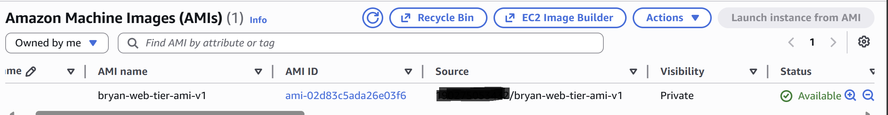

A small footnote on cost: AWS automatically creates an EBS snapshot to back the AMI.
That snapshot lives in EC2 → Snapshots and runs cents per month — $0.05/GB-month, and only used blocks are billed (not empty space), so a typical lab snapshot lands around 15–40 cents.
Trivial, but worth knowing exists for cleanup later.

---

## Step 8 — Build the launch template

If the AMI is the candidate's qualifications, the launch template is the job description.
It tells the ASG what *kind* of instance to launch — instance type, security group,
key pair, IAM role, network settings.
Without it, the ASG has no idea how to use the AMI it's been given.

I created the template at `EC2 → Launch Templates → Create launch template`
and turned on the **"Auto Scaling guidance"** toggle near the top of the form.
That toggle filters the form to show only fields that work cleanly with ASG
and hides things that would conflict, like assigning a fixed IP to a single instance.
A small thing, but it removed five things I would otherwise have second-guessed.

Key choices:

| Field | Value | Why |
|---|---|---|
| AMI | `bryan-web-tier-ami-v1` | The whole point — plug in the photocopy master |
| Instance type | `t3.micro` | Match existing fleet, free tier eligible |
| Security group | `web-sg` | Inherits the security cutover (HTTP only from `alb-sg`) |
| IAM instance profile | The Secrets Manager role from Writeup #6 | Without this, the app can't fetch DB credentials and the page breaks |
| User data | (empty) | Not needed — AMI already has Apache, PHP, and app code |

The user data choice is the elegant part.
A common pattern in older guides is to bootstrap instances with a shell script that
installs Apache, pulls code from a repo, and configures everything at boot time.
That works, but it makes new instances take 3–5 minutes to come up,
and it means the ASG depends on package mirrors and Git being reachable from inside the VPC.
Baking everything into the AMI shifts that work to "build time" instead of "boot time" —
new instances come up in roughly 60 seconds and have zero external dependencies.

Result: launch template `lt-0995b3a20f470fc98` (`bryan-web-tier-lt-v1`).

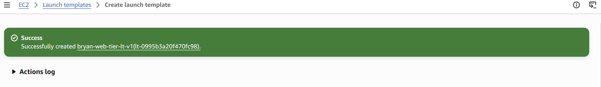

**Lesson learned the hard way:**
launch template tags don't propagate to launched instances unless you set the
**resource type** field on each tag to "Instances."
I missed this on the first pass and the ASG-launched instances showed up nameless in the EC2 console.
Easy to fix manually after the fact, but in production you'd want to edit the launch template,
publish a new version, and use **instance refresh** to replace existing instances cleanly.

---

## Step 9 — Build the Auto Scaling Group

This is the centerpiece — the manager that uses the launch template
to actually run the fleet.

The ASG creation wizard is seven steps.
The four pages where decisions actually mattered:

**Network (Step 2)**:
I selected both `bryan-lab-public-subnet` (`us-east-1a`, `10.0.1.0/24`)
and `bryan-lab-public-subnet-1b` (`us-east-1b`, `10.0.4.0/24`).
This is the single biggest resilience win of the entire architecture.
With one subnet, the ASG launches everything in one AZ — fast-replacing fleet,
but still goes down if AWS has an AZ outage.
With two, traffic and instances both span AZs and a zonal failure becomes invisible to users.

**Load balancing (Step 3)**:
Attached to the existing target group `web-tier-tg`.
The ASG now automatically registers new instances on launch and deregisters them on shutdown.
No manual target management ever again — and this is exactly what made the ALB/target group decoupling
back in Step 3 actually pay off.

**Health checks (Step 3)**:
This is the most important toggle in the entire wizard.
By default, ASG only watches **EC2 health checks** — the VM is alive,
status checks pass 2/2, instance is "healthy."
That's not enough.
If Apache crashes but the VM stays up, the EC2 health check still says "healthy"
while users get connection-refused errors at the ALB.
Turning on **ELB health checks** adds the ALB's HTTP probe to the ASG's decision-making.
If the ALB starts seeing failed health checks, the ASG treats the instance as unhealthy
and replaces it.
With grace period set to 300 seconds — enough buffer for a fresh instance to boot Apache
before the first health check is judged.

**Group size (Step 4)**:
Desired = 2, minimum = 1, maximum = 4.
Desired = 2 because that's what forces the ASG to actually distribute across AZs.
With desired = 1, multi-AZ becomes theoretical; with 2, you can verify it.
Minimum = 1 prevents drops below one running instance during scale-in events.
Maximum = 4 caps cost in case a future scaling policy misbehaves.

I deliberately skipped scaling policies on this pass.
Self-healing and dynamic scaling are different concepts, and stuffing both into one writeup
muddles which feature is doing what during testing.
A target-tracking policy is genuinely useful, but it needs real load to demonstrate properly,
and that's its own writeup with synthetic load testing and CloudWatch graphs.
Adding a policy here would be theater — it would sit there with nothing to react to.

---

## Step 10 — Watch it come up

The moment after clicking Create is the most rewarding part of the whole lab.

The ASG status flipped immediately to "Updating capacity."
Within 90 seconds, two instances were running —
one in `us-east-1a`, one in `us-east-1b`.
Multi-AZ distribution working on the very first launch event.

The Activity log reads like a plain-English description of how the ASG actually thinks:

> "A user request created an AutoScalingGroup changing the desired capacity from 0 to 2.
> An instance was started in response to a difference between desired and actual capacity,
> increasing the capacity from 0 to 2."

That sentence is the entire ASG control loop.
*Measure the gap between desired and actual. Close the gap.*
It runs that same loop forever — when an instance dies, actual drops, gap appears, fill the gap.
Self-healing is just this same algorithm running on a clock.

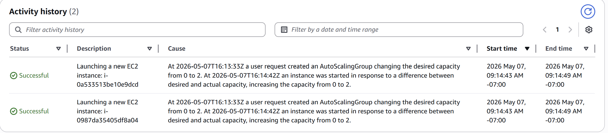

A few minutes later, the target group showed three healthy targets:
the two new ASG-managed instances, plus the original `bryan-web-tier`
which was still registered from Section 1.

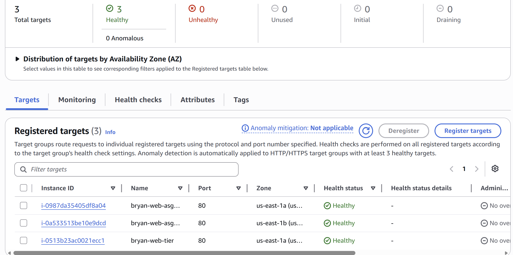

That single screenshot validates a lot of architecture in one frame:
the launch template's `web-sg` lets the ALB reach the new instances,
the IAM role works (instances can fetch from Secrets Manager),
the AMI boots Apache cleanly,
multi-AZ distribution is real,
and the ALB now load-balances across three backends instead of one.

A small bonus surfaced — the target group page noted that
*"Anomaly detection is automatically applied to HTTP/HTTPS target groups
with at least 3 healthy targets."*
Crossing the 3-target threshold quietly enabled a free request-pattern anomaly feature
without any extra configuration on my end.

---

## Step 11 — The self-healing test

Configuring an ASG to self-heal proves you can click through a wizard.
Actually killing an instance and watching the architecture recover proves you
understand what the configuration is for.

I terminated the `us-east-1a` ASG instance (`i-0987da35405df8a04`) on purpose
and refreshed the ALB URL while watching the Activity tab.

What happened, in order:

1. Termination registered immediately.
2. For roughly 30 seconds, the ALB kept trying to send some traffic to the dead instance —
   it didn't yet *know* it was dead.
   I caught one timeout in the browser during this window.
3. The ALB's health check fired, failed, fired again, failed again.
   After the second consecutive failure it marked the target unhealthy and stopped routing to it.
4. Traffic redistributed cleanly to the two surviving healthy instances.
   From this point forward, refreshes loaded normally every time.
5. The ASG noticed `actual = 1, desired = 2`, and within seconds launched a replacement.
6. The replacement (`i-0fa4acdb2a5862ad0`) booted from the AMI in roughly 60 seconds.
7. After the 300-second grace period, ALB health checks confirmed it was serving traffic,
   and the target flipped from "initial" to "healthy."
8. End state: three healthy targets again, with a different instance ID for the replacement.

Total time from termination to fully recovered fleet: about three minutes.

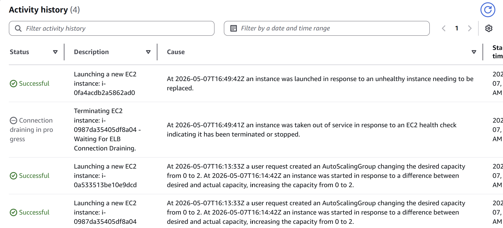

The Activity log captures the entire story in two lines —
one terminate event, one launch event in response, both marked Successful.

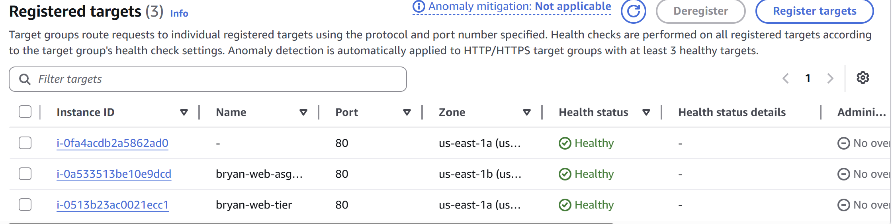

The target group view a few minutes later confirms the recovery:
three healthy targets again, with the new replacement instance ID
sitting in the same `us-east-1a` slot the terminated one used to occupy.

**The brief timeout I saw in the browser is worth being honest about.**
It would be tempting to call this an "edge case" or downplay it,
but it's a real and predictable consequence of how the ALB's health checks work.
The ALB doesn't run health checks at infinite frequency.
The default interval is 30 seconds, and the unhealthy threshold is two consecutive failures —
so under default settings, the ALB can take 30–60 seconds to detect an abrupt instance failure.
During that window, some traffic gets routed to the dead instance before the ALB stops trying.

This is exactly what techniques like circuit breakers, application-level retries,
and lower health check intervals are designed to address in production.
For a workload that genuinely cannot tolerate 60 seconds of partial degradation,
I'd dial the health check interval down to 10 seconds at the cost of more health check traffic,
add retry logic at the application layer, and make sure connections are explicitly drained
on graceful shutdown rather than terminations.

---

## Step 12 — Decommission the original instance

The ASG fleet is now self-sufficient.
The original `bryan-web-tier` is still registered in the target group from Section 1,
but it's redundant — the ASG can replace any instance that fails,
including itself, without any help from the legacy single instance.

To complete the architectural transition, I deregistered `bryan-web-tier` from `web-tier-tg`.

The ALB doesn't immediately yank the target.
It enters a state called **connection draining**, default 300 seconds.
During the drain window, the ALB stops routing *new* requests to the deregistered target
but lets *existing in-flight requests* finish naturally.
Users mid-page-load aren't dropped.
Once the timer expires (or all in-flight requests complete, whichever comes first),
the target is fully removed from the pool.

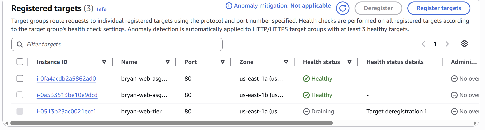

I caught this state mid-drain in the screenshot above —
the two ASG instances showing healthy alongside `bryan-web-tier` showing "Draining" with
"Target deregistration in progress" as the reason.

This is the kind of polish that distinguishes a real architecture from a tutorial.
A naive setup would do a hard cut: instance yanked, in-flight requests dropped,
some users see errors.
Connection draining gives the deregistering instance up to five minutes to wind down gracefully.

After the drain completed, I stopped the original instance rather than terminating it.
Stopped instances cost roughly $1/month in EBS storage and produce no compute charges.
The decision to keep it stopped instead of terminated:
if anything ever broke with the AMI/launch template approach,
having the original around as a fallback was worth the small ongoing cost.

The final state: the ASG fleet is now the sole population serving traffic via the ALB.

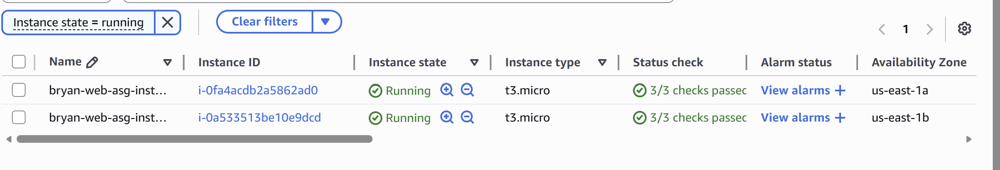

Filtered to "Instance state = running," the EC2 console shows exactly two instances —
both ASG-managed, one per AZ, both healthy.
That's the architecture I set out to build.

---

## The "instance as cattle, not pets" insight

This was the foundational mental shift I had to make to actually understand what an ASG is for.

When you launch an EC2 instance manually, you treat it as a pet.
You name it, you SSH in to fix things, you remember which one had the weird config drift,
you debug it instead of replacing it.
That's how I'd been working through the early writeups.

ASGs invert this completely.
Instances become **cattle** — interchangeable, unnamed (except by tag),
ephemeral.
If one is sick, you don't fix it.
You shoot it and let the ASG launch a replacement from the AMI.
The replacement is by definition healthier than the patient because it's a fresh
copy of a known-good template.

The corollary is that *anything you change manually on a running instance is going to vanish*
the moment that instance gets replaced.
Real changes have to go into the AMI, the launch template, or user data.
That sounds like extra friction at first, but it's the whole point —
it forces every operational change to be reproducible.

---

## Honest tradeoffs

A few things I deliberately didn't do, and why:

**Web tier stayed in public subnets.**
The original plan was to move the web tier into private subnets behind the ALB.
Moving to private subnets would mean rebuilding outbound internet access
(NAT Gateway, ~$32/month, or VPC endpoints for every service the instances need to reach).
For a lab, that cost wasn't worth it.
Instead, I achieved the same security property — the web tier can't be reached directly
from the internet — by tightening `web-sg` to only allow port 80 from `alb-sg`.
Network reachability is identical from an attacker's perspective;
the implementation is just security-group-based instead of subnet-based.
In production, I'd absolutely use private subnets with VPC endpoints for the cleanest design,
but the tradeoff was deliberate, not overlooked.

**Single instance type.**
The launch template only specifies `t3.micro`.
A more sophisticated setup would use **mixed instances** with both
On-Demand and Spot capacity, allowing the ASG to substitute instance types
when capacity is tight.
This is genuinely useful for cost optimization but adds complexity that
distracts from the core ASG concepts.
Worth a follow-up writeup specifically on mixed instance policies.

**No scaling policies.**
The ASG is configured for self-healing only, not for elasticity in response to load.
Adding target tracking or step scaling without real load data would just be ceremony.
Future writeup will pair load testing (Apache Bench or k6) with a target-tracking policy
on CPU utilization or request count, with CloudWatch graphs showing the policy actually firing.

**Original instance kept (stopped) for rollback.**
An aggressive cleanup would terminate `bryan-web-tier` immediately.
I kept it stopped instead so I have a known-good fallback if I find an issue
with the AMI later.
~$1/month in EBS storage is cheap insurance during the first few weeks of running
on the new architecture.

**HTTP only, no HTTPS.**
The ALB listener is HTTP on port 80.
A production-correct version would terminate TLS at the ALB with an ACM certificate,
listen on 443, and redirect HTTP → HTTPS.
The pieces are well-known and not particularly hard, but they require a domain name
to issue a cert against, which I don't currently have for this lab environment.
This is the most obvious next-iteration improvement.

---

## Why this matters for security engineering

This writeup sits inside a Cloud Security Engineer career pivot,
so I want to call out the security properties of what was built, not just the availability story.

**Self-healing as a security property.**
The classic incident response question for a compromised host is: *do I rebuild it or restore it?*
Restoring opens you to recurring backdoors.
Rebuilding from a known-good image is the safer choice,
but historically slow and operationally expensive.
With an ASG and a clean AMI, *rebuild from known-good* becomes the default response —
terminate the suspect instance, the ASG launches a fresh copy from the AMI in 60 seconds,
attacker persistence on the original instance is wiped automatically.

**Reproducibility and known-good state.**
Every instance in the fleet is byte-identical.
There's no "production drift" — no manual changes someone made six months ago that nobody remembers.
This makes auditing dramatically easier:
*if I trust the AMI, I trust every instance launched from it.*
A reviewer can look at the launch template + AMI version and have a complete picture
of what's running, instead of having to inventory each instance individually.

**IAM role inheritance.**
Every instance launched by the ASG inherits the same scoped IAM role
configured in the launch template.
There are no hardcoded credentials, no static keys to rotate, no per-instance permission drift.
If I need to revoke access to Secrets Manager from the entire web tier,
I edit one IAM policy and the change applies to every current and future instance.

**Reduced attack surface.**
Before this writeup, the web tier had a public IP and accepted port 80 from the open internet.
Anyone with the IP could attempt connections directly to Apache.
After the security cutover, the web tier still has a public IP (it's in a public subnet),
but `web-sg` only allows port 80 from `alb-sg`.
The attack surface visible to the internet shrinks from N web instances to 1 ALB —
and the ALB is a managed AWS service that handles its own patching, hardening, and DDoS protection.

**Multi-AZ as availability defense.**
A surprising number of attacks rely on hitting a specific endpoint until it crashes
or becomes unreachable.
Distributing instances across AZs (each an independent failure domain)
means even a successful regional service outage from a third-party doesn't take you down,
and a brute-force resource exhaustion attack against one AZ can be absorbed by the other.

---

## What I learned

The cattle-vs-pets framing finally clicked when I terminated that first instance on purpose.
I'd read about the idea for years — *treat servers as interchangeable, not unique* — but actually killing one and watching the architecture replace it without me doing anything was a different kind of understanding.
The instance I'd been configuring wasn't precious anymore.
The AMI and launch template were.

The brief timeout during the self-healing test was the other big shift.
I expected the failover to be instant.
It wasn't — there was a ~30 second window where the ALB still tried to send traffic to the dead instance before its health checks caught up.
Being honest about that gap, rather than glossing over it, is the kind of thinking I want to bring to production work.
The architecture is *self-healing*, not *zero-downtime*.
Those are different properties, and conflating them sets up the wrong expectations.

---

## What's next

The architecture work for this writeup is now complete.
Coming up:

- **Auto-scaling policies with load testing.** Add a target-tracking policy on CPU or request count,
  drive synthetic load with Apache Bench or k6, and capture CloudWatch graphs showing the policy
  scale the fleet up and back down.
- **RDS migration.** Replace the self-managed MySQL on EC2 with a managed RDS instance —
  automated backups, security group isolation, Secrets Manager integration for credential rotation.

After those, I'm pivoting fully into the security trilogy:

- **CloudTrail** for audit logging across the account.
- **VPC Flow Logs** for network-level visibility into the architecture.
- **GuardDuty** for behavioral threat detection.

Each one is a single-writeup deliverable on its own, with detection scenarios and
worked examples of what a real incident would look like in the logs.

---

*This is the seventh writeup in my AWS Solutions Architect portfolio. Earlier writeups covered [securing a fresh AWS account](2026-04-24-securing-fresh-aws-account.md), [building the VPC and subnets](2026-04-25-mini-segmented-network.md), [the bastion host pattern](2026-04-28-ec2-bastion-host.md), [adding outbound-only internet via NAT Gateway](2026-04-29-nat-gateway.md), [building a three-tier architecture](2026-05-01-multi-tier-architecture.md), and [replacing hardcoded credentials with IAM roles + Secrets Manager](2026-05-05-iam-secrets-manager.md).*
