# Writeup #8 — Migrating from Self-Managed MySQL on EC2 to Amazon RDS

**Date published:** 2026-05-11
**Lab environment:** `Bryan-lab-vpc` (10.0.0.0/16), us-east-1
**Series:** AWS Solutions Architect Portfolio — Writeup #8

---

## What this writeup is

I migrated my lab database from a self-managed MySQL instance running on EC2
(`bryan-db-tier`) to a managed Amazon RDS MySQL instance (`bryan-lab-rds-mysql`).
The PHP application running behind my ALB never knew the difference —
it kept fetching its database credentials from AWS Secrets Manager
exactly the way it did in writeup #6, and connected straight through to RDS
because the secret now pointed there instead.

This writeup walks through the build step by step,
explains the reasoning behind each architectural choice,
and includes two real debugging stories from the work:
one where a deleted VPC endpoint silently broke the entire app tier,
and one where a credential rotation looked successful but actually wasn't,
thanks to a single invisible whitespace character.

## Why I built this

Self-managed MySQL on EC2 is fine for a lab,
but in any real environment it's a maintenance burden you don't want to carry —
you're responsible for patching the OS, patching MySQL,
configuring backups, handling failover, monitoring disk, all of it.

Amazon RDS shifts those responsibilities to AWS,
which is exactly what a cloud security engineer should want:
fewer hand-managed servers, fewer surface areas to harden,
fewer places where a missed patch becomes an incident.

The migration also lets me practice the architectural muscle that matters most for security work:
keeping the admin plane and the application plane separate,
scoping security groups by reference rather than by IP,
and treating identity and least privilege as the default posture from day one.

## The architecture

The lab now has two distinct paths into the database, each with its own purpose:

| Plane | Who uses it | Source SG | Identity in MySQL |
|---|---|---|---|
| **Admin plane** | Me, from the bastion host | `bastion-sg` | `admin` (full privileges) |
| **Application plane** | The PHP app on the web tier | `app-server-sg` | `app_user` (CRUD on `demo_db` only) |

Both paths terminate at the same RDS instance,
but they come in through separate security group rules
and they authenticate as different MySQL users with different privilege levels.
That separation is the whole point —
the application should never have the credentials needed to drop a table or create a new user,
and the admin path should never be reachable from the public internet.

---

## Step 1 — Build the network foundation

### Why a new subnet

RDS requires a **DB subnet group** that spans at least two Availability Zones,
even if you launch the instance in a single AZ.
This is so RDS can move the instance to the other AZ if you ever enable Multi-AZ
or if it needs to recover from an AZ failure.

My existing lab already had a private subnet in `us-east-1a`,
but nothing in `us-east-1b`,
so I had to create a second private subnet before I could create the DB subnet group.

### What I built

- **`bryan-lab-db-subnet-1b`** — `10.0.5.0/24`, `us-east-1b`, private (no route to the internet)

I deliberately gave this subnet a name that includes `db` to make its purpose obvious in the console,
and a CIDR that doesn't overlap with anything else in the VPC.

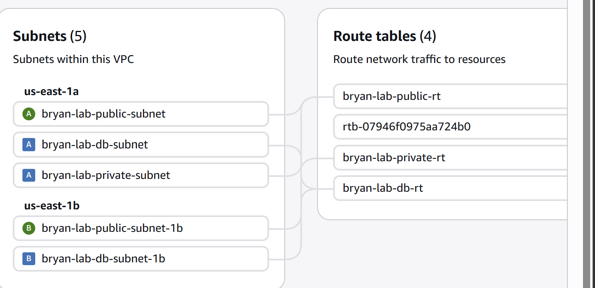

### Then the subnet group

- **`bryan-lab-db-subnet-group`** — references the existing private subnet in `1a` and the new one in `1b`

The subnet group is the object RDS actually looks at when it places the instance.
It doesn't cost anything, it's just a logical grouping that tells RDS
*"these are the subnets you're allowed to use."*

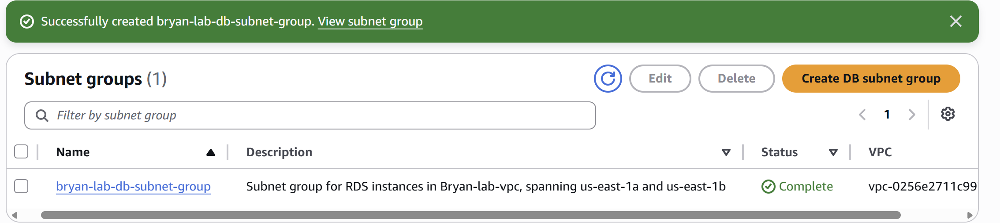

---

## Step 2 — Define the security boundary

Before launching the RDS instance, I created the security group it would use.
Doing this in advance lets me reference it by ID at launch time,
which is cleaner than launching the instance with the default SG
and then editing it after the fact.

### `rds-sg` — two inbound rules, both by SG reference

| Type | Port | Source | Purpose |
|---|---|---|---|
| MySQL/Aurora | 3306 | `sg-...` (`app-server-sg`) | Web tier → DB |
| MySQL/Aurora | 3306 | `sg-...` (`bastion-sg`) | Bastion → DB (admin) |

There is no `0.0.0.0/0` rule.
There is no specific IP at all.
Both rules reference **other security groups**, not CIDR blocks.

That's important for two reasons.
First, when my Auto Scaling Group spins up a new web tier instance,
it automatically gets the `app-server-sg` membership
and is therefore automatically allowed to talk to the database —
I don't have to update any IP allowlists when instances come and go.
Second, the rule is scoped to *only* instances inside the SG,
so even if someone got a foothold elsewhere in the VPC,
they couldn't reach the database from there.

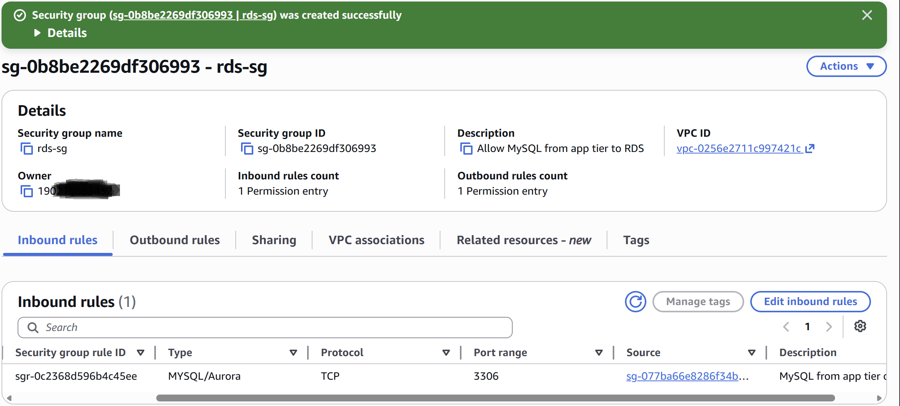

> **Note on the screenshots:** I initially configured `rds-sg` with only the `app-server-sg` rule,
> because at first I was thinking purely about the application path.
> When I went to do the admin work (schema setup) I realized I had no way in,
> and added the `bastion-sg` rule. The "after" state is captured in screenshot 05.

---

## Step 3 — Launch the RDS instance

### Instance facts

| Setting | Value |
|---|---|
| Identifier | `bryan-lab-rds-mysql` |
| Engine | MySQL 8.4.8 |
| Instance class | `db.t4g.micro` |
| Storage | 20 GB gp3 |
| Backup retention | 1 day |
| Multi-AZ | No (single-AZ for cost; subnet group is Multi-AZ ready) |
| Public access | **No** |
| Encryption at rest | **Yes** (default AWS-managed KMS key for RDS) |
| VPC | `Bryan-lab-vpc` |
| Subnet group | `bryan-lab-db-subnet-group` |
| Security group | `rds-sg` |

### Why each of these matters

**`db.t4g.micro`** is the smallest Graviton-based RDS instance type.
It's cheap and free-tier-eligible for new AWS accounts,
which makes it a sensible choice for a lab.
In a real workload I'd size based on actual query load and connection counts.

**Single-AZ** is a cost-saving choice for the lab.
Because the subnet group spans two AZs,
I can flip this instance to Multi-AZ later with a single setting change —
the architecture is ready for it, I just haven't paid for the standby.

**Public access: No** is the single most important setting on this page.
The instance gets a private DNS endpoint that only resolves inside the VPC.
There is no public IP, no route from the internet, no way for an attacker
to even attempt an authentication against this database from outside AWS.

**Encryption at rest** uses the AWS-managed `aws/rds` KMS key by default.
For lab work that's fine.
For production data I'd create a customer-managed KMS key
so I could control its rotation policy and audit who can decrypt with it.

**Backup retention: 1 day** is the minimum that still actually takes backups.
Setting it to 0 disables backups entirely, which I never want.
For a lab one day is enough. For production I'd want at least 7,
ideally with point-in-time recovery enabled to the minute.

After about 8 minutes of provisioning, the instance was available:

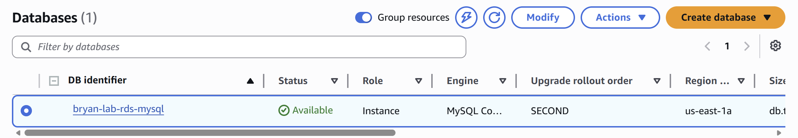

The endpoint is what the application connects to —
a private DNS name that resolves only inside the VPC:

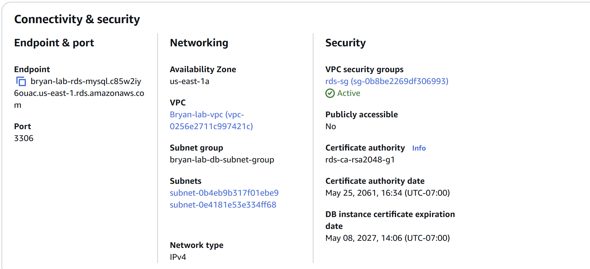

I redacted the full endpoint hostname,
but the important point is that it ends in `.rds.amazonaws.com`
and resolves only from inside the VPC.

---

## Step 4 — Admin plane: connect from the bastion and set up the schema

Now I needed to actually put data into the database.
This is the **admin plane** work: schema creation, seed data, user creation, grants.
None of this should ever happen from the application tier.

First I added the `bastion-sg` rule to `rds-sg`
(which I should have done in step 2 — flagged above):

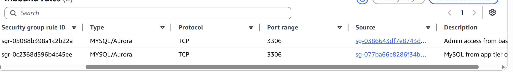

Then from the bastion, I connected to the RDS endpoint using the MariaDB client
(which speaks the MySQL wire protocol):

```bash
mysql -h bryan-lab-rds-mysql.<redacted>.us-east-1.rds.amazonaws.com \
      -u admin -p
```

It prompted for the master password, I entered it, and I was in:

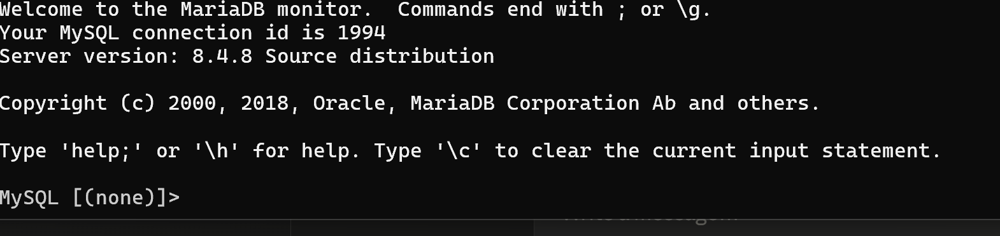

### Create the schema and seed data

```sql
CREATE DATABASE demo_db;
USE demo_db;

CREATE TABLE users (
  id INT AUTO_INCREMENT PRIMARY KEY,
  name VARCHAR(50),
  role VARCHAR(50),
  created_at DATETIME DEFAULT CURRENT_TIMESTAMP
);

INSERT INTO users (name, role) VALUES
  ('Alice',   'admin'),
  ('Bob',     'user'),
  ('Charlie', 'user'),
  ('Diana',   'user');
```

`SELECT * FROM users` confirmed the rows were there:

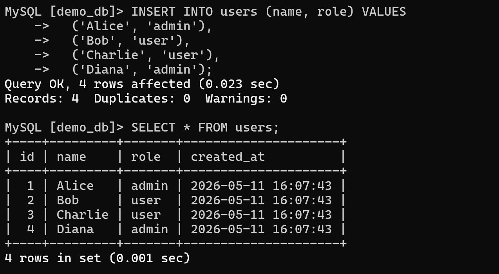

### Create the application user with least privilege

This is the single most important security step in the entire migration.

The PHP application does not need to create tables.
It does not need to drop databases.
It does not need to manage other users.
All it does is read rows and occasionally insert or update them.
So that is *all* its database credential should be allowed to do.

```sql
CREATE USER 'app_user'@'%' IDENTIFIED BY '<generated-strong-password>';
GRANT SELECT, INSERT, UPDATE, DELETE ON demo_db.* TO 'app_user'@'%';
FLUSH PRIVILEGES;
```

A few specifics worth noting.
The `'%'` host wildcard means `app_user` can connect from any source —
which sounds permissive,
but remember the **security group** already restricts that to instances inside `app-server-sg`.
The network and the database are doing two different jobs here:
the SG says *who can reach the port*, and the grant says *what they can do once they authenticate*.

The grant is scoped to `demo_db.*` — only this one database.
If I add a second database to the same instance later,
`app_user` cannot touch it without an explicit grant.

I verified the grant looked right with `SHOW GRANTS FOR 'app_user'@'%';`:

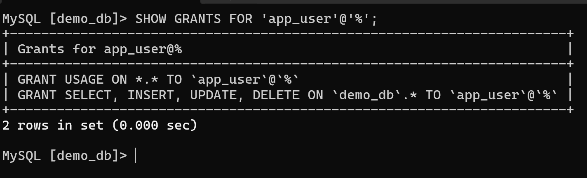

The output shows `USAGE` (the implicit "you can log in" grant)
and the four CRUD privileges on `demo_db.*`. Nothing else. No `GRANT OPTION`. No global privileges.

---

## Step 5 — Update Secrets Manager and test the app

The whole reason this migration could be a "transparent swap" for the application
is that I built the secret-fetching pattern back in writeup #6.
The PHP app does not have a database password baked into its code or its environment.
At request time, it:

1. Uses its instance profile (IAM role) to call Secrets Manager
2. Pulls the JSON secret containing `host`, `username`, `password`, `dbname`
3. Uses those values to open a MySQL connection
4. Runs its query

So to migrate the app to RDS, I didn't touch any application code.
I only had to update the secret to contain the new host, the new username, and the new password.

I edited the secret in the Secrets Manager console
and saved the new JSON:

```json
{
  "host": "bryan-lab-rds-mysql.<redacted>.us-east-1.rds.amazonaws.com",
  "username": "app_user",
  "password": "<the password I just used in the CREATE USER statement>",
  "dbname": "demo_db"
}
```

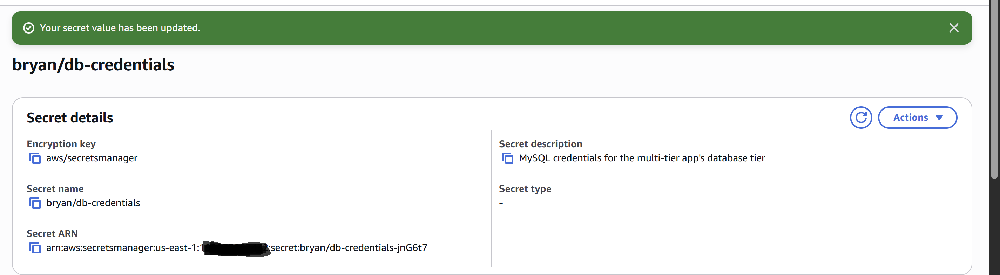

Then from the bastion, I `curl`-ed the public ALB endpoint
(which routes to a web-tier instance, which fetches the secret, which connects to RDS):

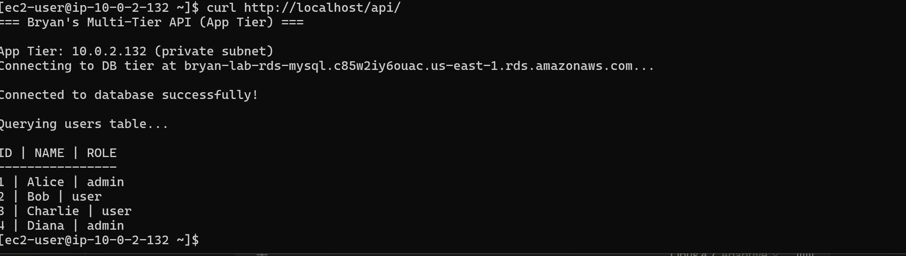

The response was the four seed rows, returned as JSON.
The application did not know — and did not need to know —
that its database had moved from a self-managed EC2 instance to a managed RDS instance.

That is the entire point of the Secrets Manager pattern.

---

## Debug story #1 — When Secrets Manager went dark

At one point during this lab, the `curl` test stopped working.
The web tier returned a 500 with a vague PHP error about being unable to connect to the database.
But MySQL was up. The security groups were unchanged. The secret was unchanged.

I SSH-ed into a web tier instance and tried calling Secrets Manager directly:

```bash
aws secretsmanager get-secret-value --secret-id bryan-lab-db-secret
```

It hung. Eventually it timed out with a network error.

The reason: I had previously deleted `bryan-lab-secretsmanager-endpoint` —
the **VPC interface endpoint** for Secrets Manager —
while cleaning up unrelated resources.
It looked like a cost-saving cleanup at the time.

But the web tier lives in a **private subnet** with no route to the internet.
The only way it can reach the Secrets Manager API
is through that VPC interface endpoint.
With the endpoint deleted,
every `secretsmanager:GetSecretValue` call from the app tier
sat there waiting for a route that didn't exist,
until it timed out and the connection failed.

I recreated the endpoint
(`bryan-lab-secretsmanager-endpoint`, attached to the private subnets,
with `app-server-sg` allowed inbound on 443),
and the next `curl` succeeded immediately.

**Lesson:** a VPC interface endpoint is not a "cost optimization" you can casually delete.
For private-subnet workloads that talk to AWS APIs,
it's load-bearing infrastructure.
Deleting it doesn't generate an alarm —
it generates a slow, silent failure that looks like an application bug.

---

## Step 6 — Rotate the application credential

To prove the rotation story works end to end,
I rotated `app_user`'s password manually.
The flow is two steps that have to stay in sync:

1. Change the password in MySQL (from the bastion)
2. Update the secret in Secrets Manager to match

```sql
ALTER USER 'app_user'@'%' IDENTIFIED BY '<new-strong-password>';
FLUSH PRIVILEGES;
```

Then in the Secrets Manager console, edit the secret,
paste the new password into the `password` field, and save.

Then `curl` the ALB again to confirm the app still works:

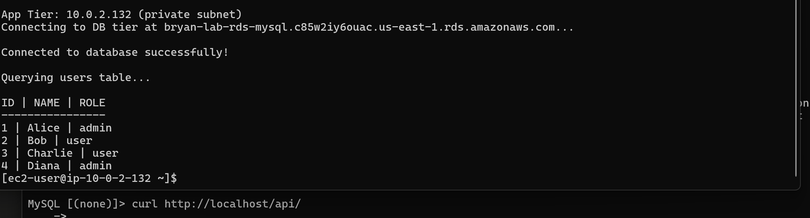

Which it did — eventually. See the next story.

---

## Debug story #2 — The invisible whitespace

The first time I tried this rotation, `curl` came back with a 500.
The PHP error: `Access denied for user 'app_user'@'%'`.

I went back to the bastion and tried to log in as `app_user`
with the password I had just set:

```bash
mysql -h <rds-endpoint> -u app_user -p
```

That worked. So the password in MySQL was definitely the password I thought it was.

I went back to Secrets Manager and re-opened the secret.
The password value *looked* identical.
Same length, same characters, same everything.

What I finally figured out:
when I copy-pasted the new password from my terminal into the Secrets Manager web form,
I had accidentally included a trailing space.
MySQL had the password as `<chars>`.
Secrets Manager had it as `<chars> `.
The PHP app fetched what Secrets Manager gave it,
sent that to MySQL, and MySQL — correctly —
told it the password was wrong.

The fix took five seconds.
The lesson took longer.

**Lesson:** when rotating credentials,
the value in MySQL and the value in Secrets Manager have to be **byte-for-byte identical**.
Copy-paste is the enemy of byte-for-byte identity.
A trailing space is invisible.
A trailing newline is invisible.
A smart-quote auto-corrected from a normal quote is invisible.

In a real environment I'd use Secrets Manager's built-in rotation feature
with a Lambda rotation function,
which generates the password programmatically
and writes it to both MySQL and the secret in the same flow —
no human eyes, no copy-paste, no whitespace.
For a lab the manual rotation is a useful exercise
specifically because it surfaces this class of problem.

---

## Why this matters for security engineering

A cloud security engineer reviewing this lab should see several things working together:

**1. The blast radius of a compromised app credential is bounded.**
`app_user` has CRUD on `demo_db` only.
It cannot create users, drop tables, or read any other database.
If an attacker gets RCE on a web tier instance and dumps the secret,
the worst they can do is read and modify rows in one database.
They cannot pivot to other databases, escalate inside MySQL, or destroy data wholesale.

**2. The database is unreachable from the internet by construction.**
The RDS instance has no public IP and no public DNS.
The only routes into port 3306 are through two specific security groups,
both of which are themselves reachable only from inside the VPC.
This is not a firewall rule that an attacker can bypass —
it's a network topology decision that doesn't have a path from the public internet at all.

**3. Identity and network are separate, layered controls.**
The security group controls who can reach the port.
The MySQL grant controls what they can do once they authenticate.
Either one alone would be insufficient.
Together they form defense in depth.

**4. Secrets never live in code, configuration files, or environment variables.**
The PHP app fetches its credential at runtime from Secrets Manager
using an IAM role attached to its EC2 instance.
There is no `.env` file with a password in it.
There is no AMI baked with credentials.
Rotating a credential is a Secrets Manager operation, not a redeployment.

**5. VPC endpoints are part of the security boundary, not a cost line.**
The web tier reaches Secrets Manager exclusively through a private interface endpoint.
Traffic to the AWS API never leaves the VPC.
This both prevents data exfiltration via DNS or HTTPS to other endpoints
and keeps the workload functional even when public internet egress is locked down.

**6. Encryption at rest is on by default and stays on.**
Storage encryption with KMS is enabled at instance creation and cannot be disabled afterward.
That's the right default — make the secure option the unavoidable option.

---

## What I learned

- **A DB subnet group needs two AZs even for a single-AZ instance.**
  RDS enforces this so future Multi-AZ is one toggle away.
  Designing the subnet group for Multi-AZ from day one is free —
  you pay for the standby only if you turn it on.

- **Reference security groups by ID, not by IP.**
  Once you start writing SG rules that reference other SGs,
  Auto Scaling stops being a security headache.
  Instances inherit their reachability from their SG membership,
  not from their (ephemeral) IP address.

- **The Secrets Manager pattern is what made this migration boring,
  and "boring" is exactly what you want from a database migration.**
  Because the application code never saw a hardcoded credential,
  moving the database from one host to another
  was a single JSON edit in one place.
  Doing it the other way — credentials in code, in environment variables, in AMIs —
  would have meant a redeploy of every web tier instance.

- **VPC endpoints are infrastructure, not cost lines.**
  This is the second time I've been bitten by this exact category of mistake
  in different forms.
  Treating endpoints like optional cost optimizations is wrong.
  They're part of how the workload functions.

- **Manual credential rotation is fragile in the most boring possible way.**
  Whitespace.
  That's it.
  That's the bug.
  In production this work belongs to a rotation Lambda
  that never lets a human's clipboard touch the value.

---

## Lab artifacts

| Resource | Identifier |
|---|---|
| DB subnet (1b) | `bryan-lab-db-subnet-1b` (10.0.5.0/24) |
| DB subnet group | `bryan-lab-db-subnet-group` |
| RDS instance | `bryan-lab-rds-mysql` (MySQL 8.4.8, db.t4g.micro) |
| RDS security group | `rds-sg` (two inbound rules: `app-server-sg`, `bastion-sg`) |
| Secrets Manager VPC endpoint | `bryan-lab-secretsmanager-endpoint` (recreated mid-lab) |
| Database | `demo_db` |
| Application user | `app_user` (CRUD on `demo_db.*` only) |

---

## What's next

The lab now has a production-shaped data tier:
managed, encrypted, privately reachable, with least-privilege application access
and a credential-rotation story.

The next set of writeups moves from *building secure infrastructure*
to *seeing what's happening on it*: CloudTrail, VPC Flow Logs, and GuardDuty,
followed by an AWS Config / Security Hub capstone that ties posture monitoring
to everything I've built so far.

---

*Part of my AWS Solutions Architect Portfolio.*
*GitHub: [RyanSec08/AWS-Solutions-Architect-project](https://github.com/RyanSec08/AWS-Solutions-Architect-project)*
*LinkedIn: [linkedin.com/in/ryanle-cloudsec](https://linkedin.com/in/ryanle-cloudsec)*
