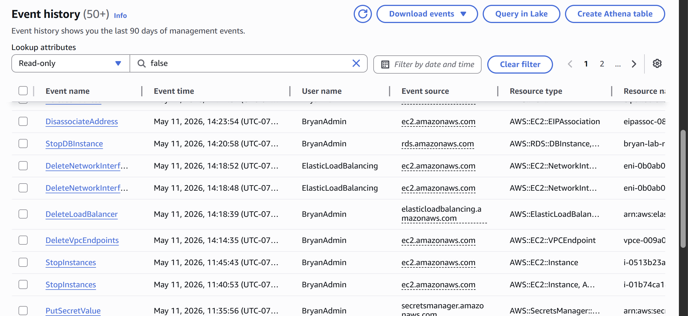
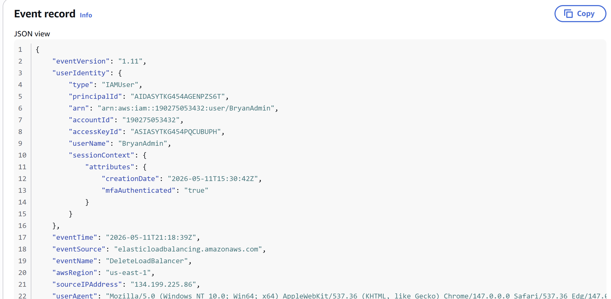
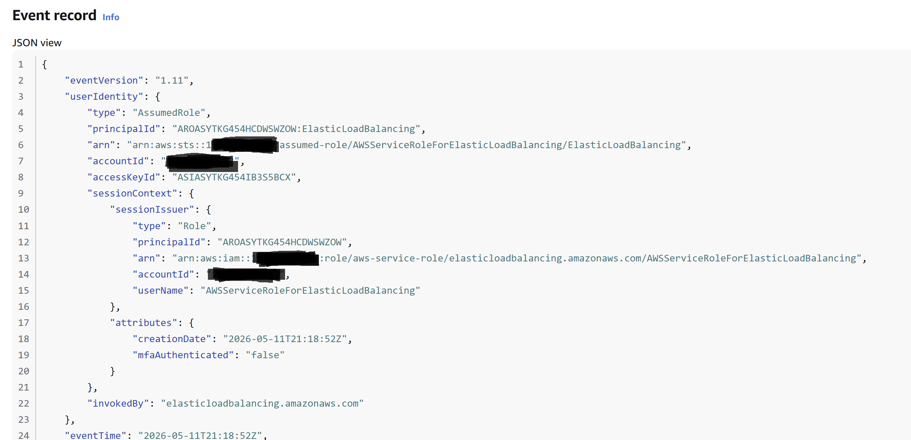
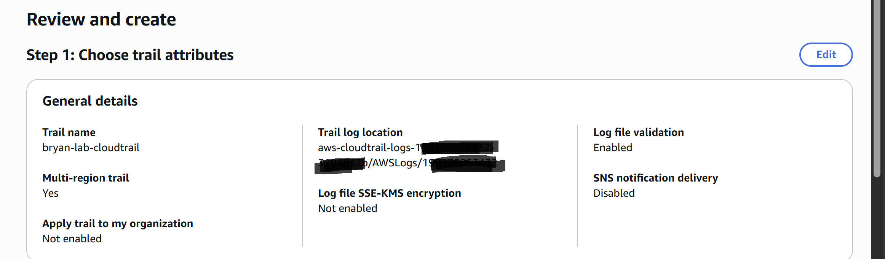
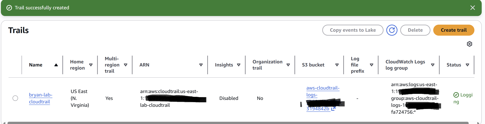
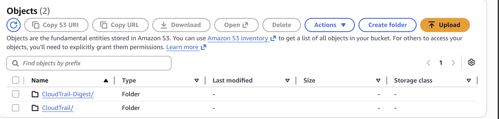
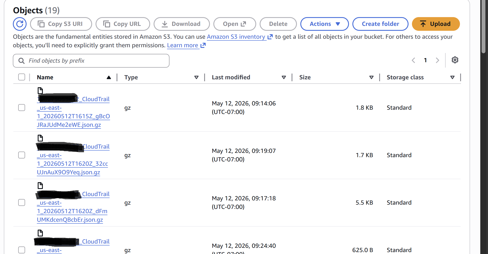
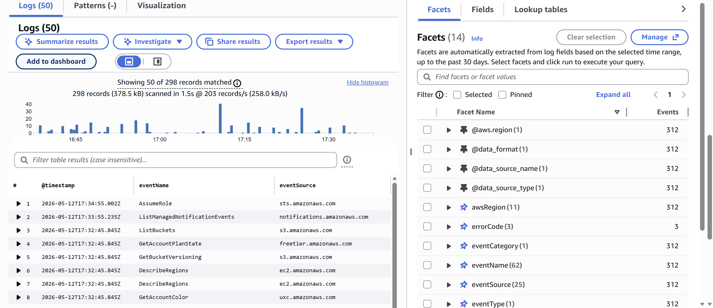
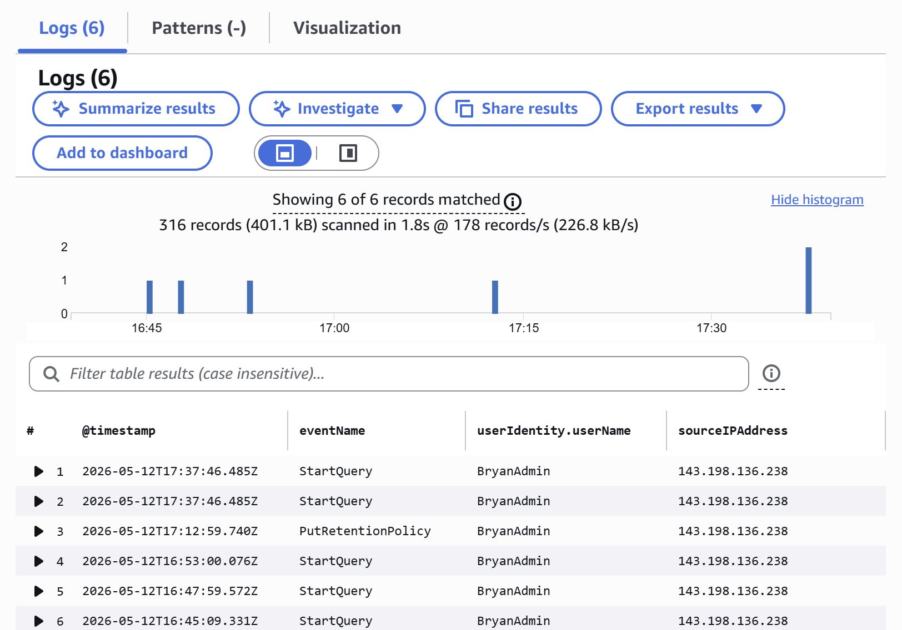
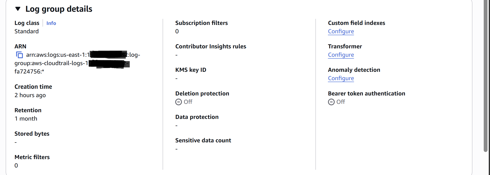

# Writeup #9 — Building an Audit Trail with AWS CloudTrail: From "Already Logging" to a Real Trail You Can Query

**Date published:** 2026-05-12
**Lab environment:** `Bryan-lab-vpc` (10.0.0.0/16), us-east-1
**Series:** AWS Solutions Architect Portfolio — Writeup #9

---

## What this writeup is

AWS has been recording every API call against my account from the day I opened it.
I just hadn't been looking.

This writeup is about finding that data,
understanding what's in each record (and what each field means for a security audit),
and then building a proper **multi-region trail** —
the durable, queryable, GuardDuty-ready version that everything else in the AWS security stack expects to exist.

Along the way I'll walk through the operational difference between Event History and a Trail,
and demonstrate how to read these logs the way a real security engineer does —
filtering for the central truth that **read events are noise, and write events are signal.**

## Why I built this

This is the first writeup in the security trilogy:
CloudTrail → VPC Flow Logs → GuardDuty.
Each one builds on the last, but CloudTrail is the foundation.
It is the audit log for every API call made in the account,
and it is the input that GuardDuty and Security Hub consume for threat detection.

Without CloudTrail, you have no record of *who did what* in your account.
With it, every action — by a human, by a service, by an attacker —
leaves a non-repudiable trace tied to an identity, a source IP, a user agent,
and a timestamp accurate to the millisecond.

This is the fundamental shift cloud security represents over on-prem.
In a traditional datacenter, the security team fights to *get* the logs —
deploying agents, scraping syslog, fighting vendors for export formats.
In AWS, the logs are already there from the moment the account exists.
The job is no longer collection; it's knowing what to do with what you've already been given.

---

## The two layers: Event History vs. Trail

CloudTrail has two distinct surfaces that are easy to confuse:

| | Event History | Trail |
|---|---|---|
| **Who turns it on** | AWS, automatically | You |
| **Retention** | 90 days, hard cap | As long as you keep the S3 objects |
| **Storage** | AWS-managed, opaque | Your S3 bucket, your control |
| **Query power** | Browser UI, basic filters | Athena, CloudWatch Logs Insights, anything that reads S3 |
| **Downstream consumers** | None | GuardDuty, Security Hub, Config, SIEMs, custom Lambda |
| **Cost** | Free | Essentially free for management events |

The right way to think about it:
**Event History** is the always-on safety net AWS keeps for everyone,
useful for recent investigations but not for anything beyond 90 days.
**A Trail** is the durable, queryable, integrable record you build for your account
that everything else in the AWS security stack expects to exist.

You want both, working together.
Event History covers the gap between an account's birth and the moment its first trail starts logging.
The trail takes it from there, indefinitely.
Together they form an unbroken audit record from day one to the present.

---

## Part 1 — Exploring what CloudTrail already records (Event History)

Before building anything new,
I went to look at what AWS had already been recording about my account.

In the CloudTrail console under **Event history**, I saw every API call from the last 90 days.
The previous afternoon's section was a complete forensic record of work I'd already done —
every step of the cost cleanup, in chronological order, with full attribution:

```
StopInstances           11:45  - EC2 instances stopped
DeleteVpcEndpoints      14:14  - Secrets Manager VPC endpoint deleted
DeleteLoadBalancer      14:18  - web-tier-alb deleted
DeleteNetworkInterface  14:18  - (the ALB's ENIs being cleaned up)
DeleteNetworkInterface  14:18  - (second ENI)
StopDBInstance          14:20  - RDS instance stopped
DisassociateAddress     14:23  - bastion EIP disassociated
ReleaseAddress          14:24  - bastion EIP released
RetireGrant             14:25  - KMS key grant retired by RDS
```



I'd spent the previous afternoon clicking around the console —
deleting endpoints, stopping instances, releasing addresses.
None of it felt particularly observable at the time.
But here it all was, captured to the second, with every parameter intact.

### The two `DeleteNetworkInterface` events are the interesting ones

Notice that the two `DeleteNetworkInterface` calls don't show me as the user —
they show `ElasticLoadBalancing` as the user name.
I didn't delete those ENIs.
When I deleted the ALB, AWS's Elastic Load Balancing service automatically cleaned up the ENIs
the ALB had attached to my subnets.

CloudTrail captures both my actions and AWS services acting on my behalf.
From an audit standpoint that's huge:
you can see the whole cascade, not just the human-driven part.

I clicked into one of these events to see the JSON record,
and the difference from a human-initiated event is the entire foundation of audit work.

---

## Part 2 — Reading a CloudTrail record (the userIdentity block)

Every CloudTrail event is a JSON record with roughly 25 fields.
Most of them are operational metadata.
The one that matters most for security work is the `userIdentity` block at the top —
the part that answers *who*.

### Case A: A human did this

Clicking into the `DeleteLoadBalancer` event from 14:18 yesterday:

```json
"userIdentity": {
    "type": "IAMUser",
    "principalId": "AIDA<redacted>",
    "arn": "arn:aws:iam::<account-id>:user/BryanAdmin",
    "accountId": "<account-id>",
    "accessKeyId": "ASIA<redacted>",
    "userName": "BryanAdmin",
    "sessionContext": {
        "attributes": {
            "creationDate": "2026-05-11T15:30:42Z",
            "mfaAuthenticated": "true"
        }
    }
},
"eventTime": "2026-05-11T21:18:39Z",
"eventName": "DeleteLoadBalancer",
"sourceIPAddress": "<my-home-ip>",
"userAgent": "Mozilla/5.0 ... Chrome/147.0.0.0 ... Edg/147.0",
"requestParameters": {
    "loadBalancerArn": "arn:aws:elasticloadbalancing:us-east-1:<account-id>:loadbalancer/app/web-tier-alb/..."
}
```



The fields that matter for a security engineer:

**`type: IAMUser`** — a human-controlled IAM user took this action,
not a service or an assumed role.

**`mfaAuthenticated: "true"`** — *this is the single most important security field in the entire record.*
It proves the action came from a session that was MFA-verified.
If you ever see a destructive API call where this field is `false`
on an IAMUser-type identity, that's an immediate red flag in an audit.

**`accessKeyId: "ASIA..."`** — the `ASIA` prefix means a *temporary* session credential issued by STS,
which auto-expires after the session ends.
Long-lived IAM user access keys start with `AKIA`.
A destructive call signed by an `AKIA` key would be a different conversation —
long-term credentials are harder to revoke and shouldn't be used for human work like this.

**`sourceIPAddress`** — my real public IP at the time of the call.
In an incident investigation, you cross-reference this against known-good IPs
to spot calls from unexpected geographies.

**`userAgent`** — tells you *how* the call was made.
Mozilla/Chrome/Edge means the AWS console.
`aws-cli/2.x` would mean a terminal.
`Boto3/x.y` would mean a Python script.
Different attack patterns leave different fingerprints here.

**`eventTime`** — always UTC (the `Z` suffix).
The console shows local time elsewhere, but the event record is UTC.
You do the time-zone math.

**`requestParameters.loadBalancerArn`** — the exact ARN of the resource I deleted.
Forensic-level precision: there's no ambiguity about what was destroyed.

### Case B: A service did this

Clicking into one of the `DeleteNetworkInterface` events from the same minute:

```json
"userIdentity": {
    "type": "AssumedRole",
    "principalId": "AROA<redacted>:ElasticLoadBalancing",
    "arn": "arn:aws:sts::<account-id>:assumed-role/AWSServiceRoleForElasticLoadBalancing/ElasticLoadBalancing",
    "accountId": "<account-id>",
    "accessKeyId": "ASIA<redacted>",
    "sessionContext": {
        "sessionIssuer": {
            "type": "Role",
            "arn": "arn:aws:iam::<account-id>:role/aws-service-role/elasticloadbalancing.amazonaws.com/AWSServiceRoleForElasticLoadBalancing",
            "userName": "AWSServiceRoleForElasticLoadBalancing"
        },
        "attributes": {
            "creationDate": "2026-05-11T21:18:52Z",
            "mfaAuthenticated": "false"
        }
    },
    "invokedBy": "elasticloadbalancing.amazonaws.com"
}
```



Walk down what changed:

**`type: "AssumedRole"`** instead of `IAMUser`.
A role was assumed to make this call, not a human signing in.

**`principalId` has a colon in it** (`AROA...:ElasticLoadBalancing`).
The format is `RoleId:SessionName`.
The `AROA` prefix means an IAM role
(versus `AIDA` for IAM users, which I just saw above).

**The `arn` contains `aws-service-role/`** in the `sessionIssuer` path.
That path component is the signature of a **service-linked role (SLR)** —
a special IAM role AWS creates and manages on your behalf for each service.
You can't edit these the way you would a regular role; the service owns them.
When I deleted the ALB, the ELB service used *its* SLR to clean up the ENIs.

**`mfaAuthenticated: "false"`** — services don't do MFA, obviously.
But this is the most important security tripwire in CloudTrail:
`false` is fine *here* because the actor is a known service-linked role.
If you saw `mfaAuthenticated: false` on a call where `type` was `IAMUser`,
that would mean a human used long-term credentials without strong auth
to do something destructive — exactly the pattern of a stolen-credential attack.

**`invokedBy: "elasticloadbalancing.amazonaws.com"`** —
this field only exists when an AWS service initiated the call.
If `invokedBy` is missing, the action came from a human or a programmatic actor
using credentials directly.
This single field is the cleanest way to tell those two cases apart in an automated rule.

### A detection rule pattern this contrast makes possible

The whole reason this comparison matters is that it lets you write rules like:

> Alert on `DeleteLoadBalancer` OR `DeleteNetworkInterface`
> where `userIdentity.type == "IAMUser"`
> AND `mfaAuthenticated == false`.

That rule **ignores** the normal cascade (because the ELB cleanup is `AssumedRole` with `invokedBy`),
but **fires** on a human destroying infrastructure without strong auth.
The signal-to-noise ratio of a good detection rule is built on exactly this kind of distinction.

---

## Part 3 — Building the trail

Event History was already showing me everything I wanted to see.
But Event History has a 90-day cap and you can't run real queries against it,
so I needed an actual trail.

### Trail configuration

| Setting | Value |
|---|---|
| Trail name | `bryan-lab-cloudtrail` |
| Apply to all regions | **Yes** (multi-region) |
| Storage | New S3 bucket (auto-named by AWS) |
| Log file SSE-KMS encryption | **Disabled** (default SSE-S3 is fine for lab) |
| **Log file validation** | **Enabled** |
| SNS notifications | Disabled |
| CloudWatch Logs integration | **Enabled** |
| Log group | `aws-cloudtrail-logs-<account>-<random>` (auto-named) |
| IAM role | `CloudTrailRoleForCloudWatchLogs_bryan-lab-cloudtrail` |
| Management events | **Enabled** (read + write) |
| Data events | **Disabled** (cost-conscious lab choice) |
| Insights events | Disabled |



### Why each of these matters

**Multi-region: yes.**
The trail listens in every AWS region, not just the one I work in.
This matters because if an attacker compromises credentials,
their first move is often to spin up resources in a region you don't normally use —
on the assumption your monitoring is regional.
A multi-region trail catches that.

**Log file validation: enabled.**
This generates an hourly digest file containing SHA-256 hashes of every log file
delivered in that hour, plus a signature chain linking each digest to the previous one.
If anyone ever modifies, deletes, or adds a log file in the S3 bucket,
the digest chain breaks and `aws cloudtrail validate-logs` tells you exactly which file.
It's free.
There's no reason to ever turn it off.

**SSE-KMS encryption: disabled (for lab).**
By default, S3 encrypts the logs with SSE-S3 (AWS-managed keys, free).
KMS encryption adds a per-month KMS key cost and management overhead.
For production trails handling regulated data I would enable SSE-KMS
with a customer-managed key, so I control rotation and have an audit trail
of who decrypted what.
For a lab, SSE-S3 is enough.

**CloudWatch Logs integration: enabled.**
This is what lets you write real-time queries against the logs
with CloudWatch Logs Insights, instead of having to set up Athena over S3 manually.
The cost at lab volume is fractions of a dollar per month.
It is the single best ergonomic upgrade you can give yourself for log exploration.

**Management events: enabled. Data events: disabled.**
Management events are the API calls that *change configuration* —
creating resources, modifying policies, deleting things.
Data events log every individual S3 object access and every Lambda invocation.
For a lab they would inflate the bill enormously for almost no security value.
For production workloads handling sensitive data, you'd enable data events selectively
on the buckets and functions that actually warrant per-access auditing.

After clicking Create, the trail showed up in the Trails list with status `Logging`:



---

## Part 4 — Where the logs actually live (the S3 layout)

CloudTrail delivers events to S3 in a very specific, structured way,
and understanding that structure matters
because it's what every downstream tool — GuardDuty, Security Hub, Athena, Glue — expects.

Inside the bucket, the prefix structure is:

```
AWSLogs/<account-id>/CloudTrail/<region>/<YYYY>/<MM>/<DD>/
AWSLogs/<account-id>/CloudTrail-Digest/<region>/<YYYY>/<MM>/<DD>/
```

Two folders side by side: one for the data, one for the integrity digests.



The `CloudTrail-Digest/` folder is the byproduct of having log file validation enabled.
In a real incident response, this is the difference between
"we have logs" and "we have logs we can prove are authentic and unmodified."
That distinction is what holds up in a forensic context.

Inside the deepest folder, the files look like this:

```
<account>_CloudTrail_us-east-1_20260512T1615Z_gBcOJRaJUdMe2eWE.json.gz
<account>_CloudTrail_us-east-1_20260512T1620Z_32ccUJnAuX9O9Yeq.json.gz
<account>_CloudTrail_us-east-1_20260512T1620Z_dFmUMKdcenQBcbEr.json.gz
```



The filename pattern: `<account-id>_CloudTrail_<region>_<YYYYMMDDTHHMMZ>_<random>.json.gz`.

The timestamp is baked right into the filename,
which means downstream tools can prune to a time range *just by filename matching* —
they don't have to open the files to know if they're relevant.
That speed is why this layout is the industry standard for log delivery to object storage.

CloudTrail batches events into a new file every ~5 minutes
(or sooner if the batch fills up).
After gzip, files are tiny — 600 bytes to 5 KB for my lab volume.
A whole month of these will cost cents.

**The crucial mental model:**
this S3 bucket is the source of truth.
CloudWatch Logs is a convenient projection for live querying,
but it can lag, and people set retention to expire it.
The S3 trail is the durable, tamper-evident, forever record.
When I build GuardDuty in writeup #11, this is the bucket it'll consume.

---

## Part 5 — Querying the logs (CloudWatch Logs Insights)

The CloudWatch Logs view of these events is, frankly, ugly.
Each log group is divided into multiple *streams* (one per region per chunk of time),
and the default view dumps the raw JSON of each event into a Timestamp + Message table.
You can't easily search, you can't pivot, and you definitely can't write structured queries.

The proper tool is **CloudWatch Logs Insights** — a query language over your logs,
specifically designed for this kind of structured event data.

### Query 1 — A first attempt at finding `CreateTrail`

I started with a targeted query, looking for the API call that created this very trail:

```sql
fields @timestamp, eventName, eventSource, userIdentity.userName, sourceIPAddress
| filter eventName = "CreateTrail"
| sort @timestamp desc
```

Result: **No events found.**

This was an accidental teaching moment.
The trail can only log events that happen *after* it is active.
The `CreateTrail` API call fires a moment *before* the trail's logging pipeline is provisioned,
which means the trail does not — and structurally cannot — log its own creation.

It's still in Event History (the automatic 90-day log AWS keeps for everyone),
and the *next* events after CreateTrail (like the `PutEventSelectors` that configures the trail)
will show up in the trail's logs.
But CreateTrail itself doesn't appear in this trail.

**The operational implication:** create your CloudTrail trail on day one of a new account.
Before any other resource is created.
That way the trail captures everything from minute one,
and you don't have to rely on Event History for the foundational events.

### Query 2 — Reducing the noise (signal vs noise)

A broader query (`fields @timestamp, eventName, eventSource | sort @timestamp desc | limit 50`)
returned roughly 300 records from the last hour.

Almost all of them were noise:

```
AssumeRole                  sts.amazonaws.com
ListManagedNotificationEvents  notifications.amazonaws.com
ListBuckets                 s3.amazonaws.com
GetAccountPlanState         freetier.amazonaws.com
GetBucketVersioning         s3.amazonaws.com
DescribeRegions             ec2.amazonaws.com
... ~290 more ...
```



These are the AWS console **rendering pages**.
Every time I loaded a console page, it fired a dozen `Describe*`, `Get*`, and `List*` APIs to populate the UI.
CloudTrail dutifully logged each one.

This is the central insight of real CloudTrail analysis:
**read events are noise; write events are signal.**
A real security engineer filters them out before doing anything else.

### Query 3 — The filter that matters

```sql
fields @timestamp, eventName, userIdentity.userName, sourceIPAddress
| filter userIdentity.type = "IAMUser"
| filter eventName like /^(Create|Delete|Update|Modify|Put|Start|Stop|Attach|Detach|Run|Terminate|Reboot)/
| sort @timestamp desc
| limit 50
```

Two filters in series:
the first strips out anything that wasn't a human IAM user
(so service-linked roles, federated identities, and AWS-internal calls all get dropped),
the second keeps only event names that match the *write-action* verbs.

Result: **6 events out of ~300.**

```
2026-05-12T17:37:46Z  StartQuery            BryanAdmin  <my-home-ip>
2026-05-12T17:37:46Z  StartQuery            BryanAdmin  <my-home-ip>
2026-05-12T17:12:59Z  PutRetentionPolicy    BryanAdmin  <my-home-ip>
2026-05-12T16:53:00Z  StartQuery            BryanAdmin  <my-home-ip>
2026-05-12T16:47:59Z  StartQuery            BryanAdmin  <my-home-ip>
2026-05-12T16:45:09Z  StartQuery            BryanAdmin  <my-home-ip>
```



Look at what's in this result.
Five of the six events are `StartQuery` — me running these Logs Insights queries.
The query that searches for write events is itself a write event,
so it's logged, and I'm now looking at audit evidence of myself looking at audit evidence.

The sixth event is `PutRetentionPolicy` —
the API call that fired when I changed the log group's retention from "Never expire" to 30 days
in a later step of this writeup.
That action was a different shape than running queries —
a one-time configuration change rather than ad-hoc exploration —
and the filter caught it too,
because `PutRetentionPolicy` matches the `Put` prefix in the write-action regex.

That is the central property of a good detection filter:
it should catch *every* state-changing thing the actor did,
regardless of which specific API was called,
and drop everything that was just reading state to populate a UI.
Six events here represent my entire operational footprint for the hour.
The other ~294 were noise.

This is what real security engineering looks like:
a small number of high-signal events surfaced from a sea of noise,
filtered by patterns that make sense for the threat model,
and queryable in seconds against any time range you have logs for.

---

## Part 6 — Setting a retention policy

When you enable CloudWatch Logs integration on a CloudTrail trail,
the log group is created with retention set to **Never expire** by default.
That is a real cost trap — the logs accumulate forever, and you pay for the storage indefinitely.

I changed retention to **30 days**:



Why 30: it's a sensible lab default.
Long enough to query recent activity for writeup demos and tuning detections,
short enough that the CloudWatch storage bill stays negligible.
Anything older than 30 days is still in the S3 bucket — which has no expiration set —
so for historical analysis I would use Athena against S3, not CloudWatch.

For real environments, retention is usually set by compliance:
HIPAA, PCI, SOC2, and most enterprise security policies dictate a floor of 90 days to several years.
The right number depends on what data the workload touches and what regulations apply.

The key thing is to *make a deliberate choice*, not leave it at the default.
"Never expire" almost always means "expire when someone finally notices the bill" —
which is the worst possible moment to discover your retention policy.

---

## Why this matters for security engineering

A cloud security engineer reviewing this setup should see several properties working together:

**1. Non-repudiation.**
Every API call against the account is recorded with the identity that made it,
the IP it came from, the tool used (user agent), and a timestamp accurate to the millisecond.
There is no realistic way for an authenticated actor to take action and have it not be logged,
because CloudTrail is integral to AWS itself rather than an external monitor.

**2. The `mfaAuthenticated` field is the strongest single security signal in any record.**
For human-driven actions, this field's value answers
*"did this person prove they were really them?"*
Detection rules built around this field are some of the highest signal-to-noise
rules a security team can write.

**3. The distinction between human-driven and service-driven actions is preserved by structure.**
The `userIdentity.type` field, the presence of `invokedBy`,
and the `sessionContext.sessionIssuer` block let you write rules that ignore the legitimate
cascade of AWS services cleaning up after each other,
while still firing on direct human actions taken without proper auth.

**4. Logs are tamper-evident.**
Log file validation creates a cryptographic chain that proves
the log files in S3 haven't been modified.
This isn't optional in a real environment —
it's the difference between forensic-grade evidence and an unverifiable claim.

**5. The S3 bucket is the integration point for the rest of the security stack.**
GuardDuty, Security Hub, AWS Config, Detective, and almost every third-party SIEM
read CloudTrail logs in the standardized S3 prefix layout.
By configuring the trail correctly,
I've laid the foundation for everything that comes after in the security trilogy.

**6. Read events are noise; write events are signal.**
The default CloudTrail volume is dominated by `Describe*`/`Get*`/`List*` calls
that AWS consoles fire every time someone loads a page.
Real detections filter for state-changing actions
(`Create*`, `Delete*`, `Put*`, `Stop*`, `Modify*`, etc.)
where the actor is a human (`userIdentity.type == "IAMUser"`).
Everything else is background.

---

## What I learned

- **CloudTrail Event History was on from day one of my account, for free, with no setup.**
  The "you don't know what you don't know" problem in cloud security is largely solved by AWS for you —
  the data is there from the start.
  The job of the security engineer is to *know to look*.

- **The trail can't log its own creation.**
  This is a small but important consequence of how event delivery works:
  the trail's logging pipeline isn't active until after the CreateTrail call has completed.
  Build the trail on day one of any new account so you don't have to rely on Event History
  for the foundational events.

- **The CloudWatch Logs view of CloudTrail data is unreadable raw; Logs Insights makes it usable.**
  If you ever find yourself scrolling through individual log entries in the streams view,
  stop and write a query.
  Logs Insights queries are how real security engineers read CloudTrail.

- **Service-linked roles are not just an annoyance; they're a security feature.**
  By creating distinct identities for each AWS service that acts on your behalf,
  AWS makes the difference between "user did X" and "service did X" visible in the audit log.
  Without this design, every `DeleteNetworkInterface` would look like a human action and tonnes of false positives would follow.

- **`Never expire` is a default, not a recommendation.**
  Both CloudWatch log groups and S3 buckets default to keeping data forever.
  Sometimes that's right; usually it's not.
  Always make retention a deliberate choice, sized to the threat model and the compliance requirements.

---

## Lab artifacts

| Resource | Identifier |
|---|---|
| Trail | `bryan-lab-cloudtrail` (multi-region, us-east-1 home) |
| Trail S3 bucket | `aws-cloudtrail-logs-<account>-<random>` (auto-named) |
| Trail digest bucket prefix | `AWSLogs/<account>/CloudTrail-Digest/` |
| CloudWatch log group | `aws-cloudtrail-logs-<account>-<random>` |
| Trail IAM role | `CloudTrailRoleForCloudWatchLogs_bryan-lab-cloudtrail` |
| Log file validation | Enabled |
| Storage encryption | SSE-S3 (default) |
| Management events | Read + Write |
| Data events | Disabled |
| CloudWatch retention | 30 days |
| S3 retention | None (kept indefinitely) |

---

## What's next

CloudTrail is the foundation.
Now that it's running, the rest of the security trilogy has something to build on.

Next writeup is **VPC Flow Logs (#10)** — the network-traffic equivalent of CloudTrail.
Where CloudTrail tells you *what API was called*,
Flow Logs tell you *what packets flowed* —
accepted, rejected, source, destination, port, protocol.
The two together are what GuardDuty (writeup #11) consumes to make threat detections.

The lab itself needs to come back online before Flow Logs has anything meaningful to record:
restart the bastion, recreate the Secrets Manager VPC endpoint, recreate the ALB,
start the RDS instance, and bring the ASG up to `desired=2`.
That bring-up will be the first step of the next writeup —
and from then on, every packet that moves through the VPC will leave a trace,
just like every API call already does.

---

*Part of my AWS Solutions Architect Portfolio.*
*GitHub: [RyanSec08/AWS-Solutions-Architect-project](https://github.com/RyanSec08/AWS-Solutions-Architect-project)*
*LinkedIn: [linkedin.com/in/ryanle-cloudsec](https://linkedin.com/in/ryanle-cloudsec)*
